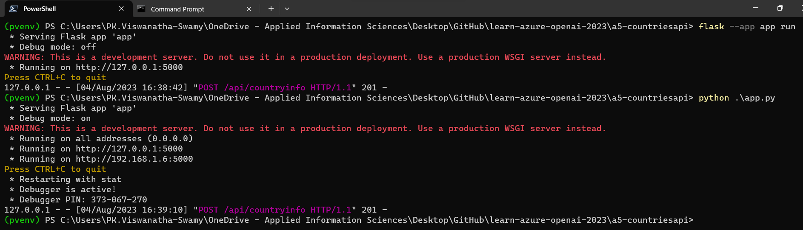
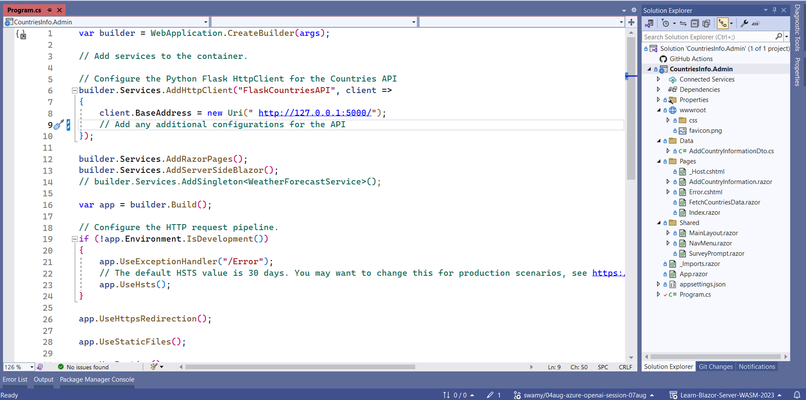
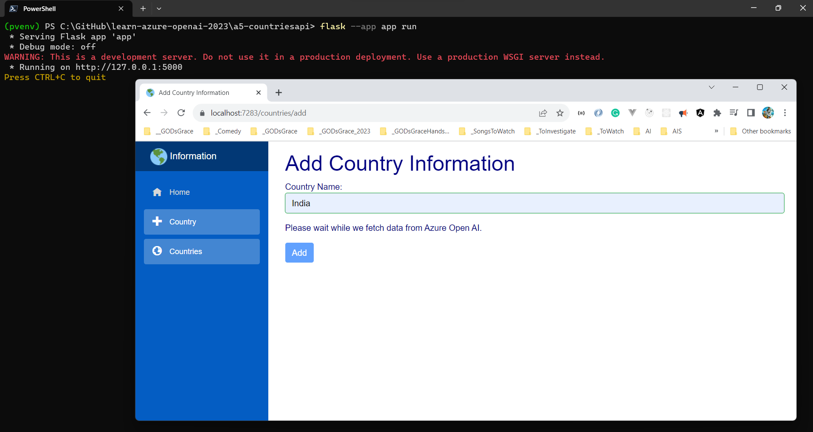
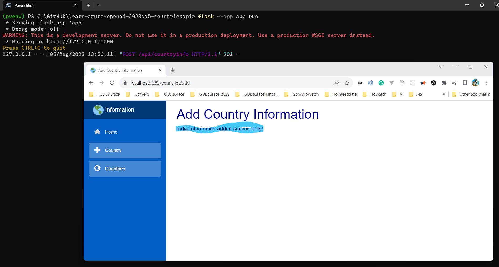

# Azure OpenAI - Mini Project - Python, Azure SQL, .NET 7 Minimal API, Blazor Server, and Postman

## Date Time: 07-Aug-2023 at 09:00 AM IST

## Event URL: [https://www.meetup.com/dot-net-learners-house-hyderabad/events/294280219](https://www.meetup.com/dot-net-learners-house-hyderabad/events/294280219)

## YouTube URL: [https://www.youtube.com/watch?v=ppcS_V3rFkg](https://www.youtube.com/watch?v=ppcS_V3rFkg)


---

### Software/Tools

> 1. OS: Windows 10 x64
> 1. Python / .NET 7
> 1. Visual Studio 2022
> 1. Visual Studio Code

### Prior Knowledge

> 1. Programming knowledge in C# / Python
> 1. Azure

## Technology Stack

> 1. .NET 7, Azure, OpenAI

## Information


## What are we doing today?

> 1. To be decided
> 1. SUMMARY / RECAP / Q&A
> 1. What is next ?

### Please refer to the [**Source Code**](https://github.com/vishipayyallore/speaker-series-2023/tree/main/AzureOpenAI) of today's session for more details

---


---

## 1. Setting up Azure SQL Database, Tables and Stored Procedures

> 1. Discussion on Azure SQL Database, Tables and Stored Procedures

```sql
SELECT * FROM [dbo].[CountriesInfo]

-- delete [dbo].[CountriesInfo]
```

### 1.1. Table Creation

```sql
CREATE TABLE CountriesInfo (
    [CountryId] INT IDENTITY (1, 1) NOT NULL PRIMARY KEY,
    [CountryName] NVARCHAR(100),
    [CapitalState] NVARCHAR(100),
    [NationalBird] NVARCHAR(100),
    [CountryPopulation] BIGINT
);
```

### 1.2. Stored Procedure Creation

```sql
CREATE PROCEDURE [dbo].[usp_insert_country_info]
    @CountryName NVARCHAR(100),
    @CapitalState NVARCHAR(100),
    @NationalBird NVARCHAR(100),
    @CountryPopulation BIGINT,
    @CountryId INT OUTPUT
AS
BEGIN
    
    SET NOCOUNT ON;

    INSERT INTO CountriesInfo 
        (CountryName, CapitalState, NationalBird, CountryPopulation)
    VALUES 
        (@CountryName, @CapitalState, @NationalBird, @CountryPopulation);

    SET @CountryId = SCOPE_IDENTITY();

    SELECT @CountryId AS CountryId;
    
END;
```


## 2. Create a Python Flask Web API to Invoke SQL Stored Procedure

> 1. Discussion and Demo
> 1. **SQLAlchemy** is a Python ORM (Object-Relational Mapping) library that simplifies database interactions by allowing developers to work with Python classes and methods instead of raw SQL, making it easier to perform database operations.
> 1. SQLAlchemy allows invoking a **stored procedure** using the db.session.execute() method, passing the stored procedure's text as a SQL expression along with parameters if required, and fetching the result if needed.

### 2.1. Python Flask Web API Project Structure

> 1. `api_routes.py`: This file contains API routes and handling for adding country information.
> 1. `models.py`: This file defines the SQLAlchemy database model for the CountryInfoDto table.
> 1. `db_config.py`: This file contains the SQLAlchemy database configuration using the db object.
> 1. `env_config.py`: This file handles loading environment variables from the .env file.
> 1. `error_handling.py`: This file contains the utility function for handling error responses.
> 1. `GetCountryInfoFromAzureOpenAI.py`: This file handles integration with Azure OpenAI to fetch country information.
> 1. `logging_config.py`: This file configures logging settings for the Flask app.
> 1. `app.py`: This file is the entry point of the Flask application and sets up the app with configurations.


### 2.2. How to execute the Python Flask API?

```python
flask --app app run

python .\app.py
```



## 3. Testing Python Flask Web API using Postman

> 1. Discussion and Demo


## 4. Integrating Python Flask Web API using Blazor Server App

> 1. Discussion and Demo

### 4.1. Blazor Server App Project Structure

> 1. `Properties` folder: This folder contains the launchSettings.json file that contains the configuration for launching the app.
> 1. `wwwroot` folder: This folder contains the static files that are served by the app.
> 1. `Pages` folder: This folder contains the Razor components that define the UI of the app.
> 1. `Shared` folder: This folder contains the Razor components that are shared across multiple pages.
> 1. `Program.cs`: This file contains the entry point of the app.



### 4.2. Blazor Server App Consuming Python Flask Web API





## 5. Retrieving Countries Information using .NET 7 Minimal API

> 1. Discussion and Demo

## 6. Testing Countries Information .NET 7 Minimal API using Postman

> 1. Discussion and Demo

---

## SUMMARY / RECAP / Q&A

> 1. SUMMARY / RECAP / Q&A
> 2. Any open queries, I will get back through meetup chat/twitter.

---

## What is Next? session?

> 1. To be decided
