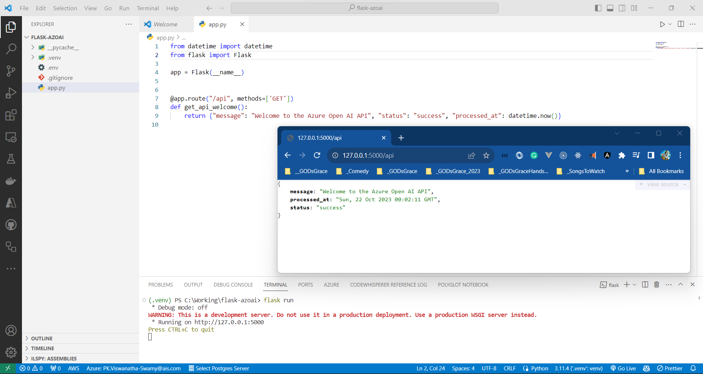

# Chat GPT Clone - Python Flask, Azure Open AI, HTML, JavaScript, Bootstrap 5.x

## Date Time: 22-Oct-2023 at 09:00 AM IST

## Event URL: [https://www.meetup.com/dot-net-learners-house-hyderabad/events/295456891](https://www.meetup.com/dot-net-learners-house-hyderabad/events/295456891)

## YouTube URL: [https://www.youtube.com/watch?v=ppcS_V3rFkg](https://www.youtube.com/watch?v=ppcS_V3rFkg)


---

### Software/Tools

> 1. OS: Windows 10 x64
> 1. Python / .NET 7
> 1. Visual Studio 2022
> 1. Visual Studio Code

### Prior Knowledge

> 1. Programming knowledge in C# / Python
> 1. Azure

## Technology Stack

> 1. .NET 7, Azure, OpenAI

## Information


## What are we doing today?

> 1. To be done
> 1. SUMMARY / RECAP / Q&A
> 1. What is next ?

### Please refer to the [**Source Code**](https://github.com/ViswanathaSwamy-PK-TechSkillz-Academy/learn-azure-openai) of today's session for more details

---


---

## The Big Picture


## 1. Creating Flask Web API to interact with OpenAI

> 1. Discussion and Demo

### 1.1. Create a Virtual Environment

> 1. Discussion and Demo
> 1. Select the Python Interpreter in Visual Studio Code which is created inside the virtual environment

```bash
py -0p
pip install virtualenv
python -m venv .venv
./.venv/Scripts/activate
pip freeze
deactivate
```


### 1.2. Install the required packages

> 1. Discussion and Demo

```bash
pip install flask
pip install openai
pip install python-dotenv
```


### 1.3. Create a .env file and update the Environment Variables

> 1. Discussion and Demo

```bash
COMPLETIONS_MODEL="text-davinci-003-dev-001"
OPENAI_API_BASE="https://<your resource name>.openai.azure.com"
OPENAI_API_VERSION="2022-12-01"
OPENAI_API_KEY=YourAPIKEY-11x1x111111x1xxx1x111x1x11x11x1x
```

```powershell
[System.Environment]::SetEnvironmentVariable('OPENAI_API_KEY', 'YourAPIKEY-11x1x111111x1xxx1x111x1x11x11x1x', 'User')
```

### 1.4. Create a .gitignore file

> 1. Discussion and Demo

```.gitignore
.venv/
.env
```

### 1.5. Create a Flask Web API with 1st API Endpoint

> 1. Discussion and Demo
> 1. Create a file called `app.py` and add the below code

```python
from datetime import datetime
from flask import Flask

app = Flask(__name__)


@app.route("/api", methods=['GET'])
def get_api_welcome():
    return {"message": "Welcome to the Azure Open AI API", "status": "success", "processed_at": datetime.now()}

if __name__ == "__main__":
    app.run()
```

### 1.6. Run the Flask Web API

> 1. Discussion and Demo

```bash
flask run
```



### 1.7. Serving HTML Pages, and other Static Assets

> 1. Discussion and Demo

```python
from flask import Flask, render_template

app = Flask(__name__, static_url_path='/static')

@app.route("/")
def index():
    return render_template("index.html")
```

> In summary, the static folder is for storing static assets like stylesheets and JavaScript files, while the templates folder is for storing HTML templates that Flask uses to render dynamic content. Both folders are essential for building web applications in Flask, as they help separate concerns between static presentation and dynamic content.


### 1.8. Create an API Endpoint to interact with OpenAI

> 1. Discussion and Demo

```python
from flask import Flask, render_template, request
import openai
import os
from dotenv import dotenv_values

# Load config values
config_details = dotenv_values(".env")

openai.api_type = "azure"
openai.api_base = config_details['OPENAI_API_BASE']
openai.api_version = config_details['OPENAI_API_VERSION']
openai.api_key = os.getenv("OPENAI_API_KEY")

@app.route("/api/get", methods=['GET'])
def get_completion_response():
    user_input = request.args.get('userinput')
    print("User Text: ", user_input)
    response = get_response_from_aoai(user_input)
    print("AOAI Response: ", response)
    return str(response)


def get_response_from_aoai(user_input):
    user_prompt = f"User Input: {user_input}\n\n"

    try:
        response = openai.Completion.create(
            engine=config_details['COMPLETIONS_MODEL'],
            prompt=user_prompt,
            temperature=1,
            max_tokens=150,
            top_p=0.5,
            frequency_penalty=0,
            presence_penalty=0,
            stop=None
        )

        answer = response.choices[0].text
        return answer
    except Exception as e:
        print("An exception has occurred:", str(e))
        return "An error occurred while processing the request."
```


---

## SUMMARY / RECAP / Q&A

> 1. SUMMARY / RECAP / Q&A
> 2. Any open queries, I will get back through meetup chat/twitter.

---

## What is Next? session?

> 1. To be decided
