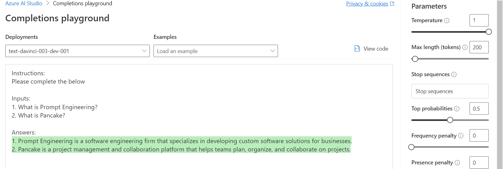
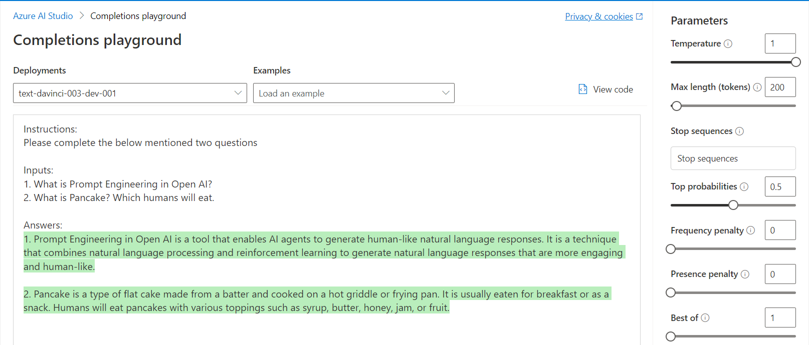
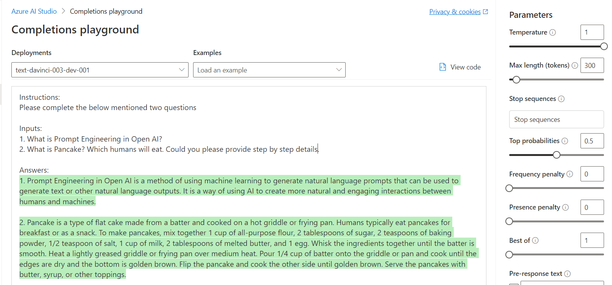
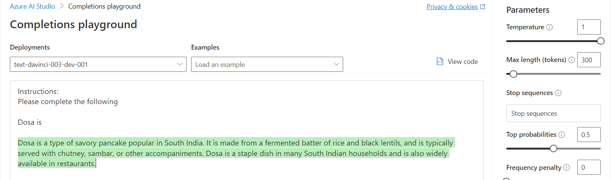
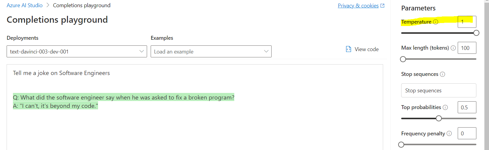
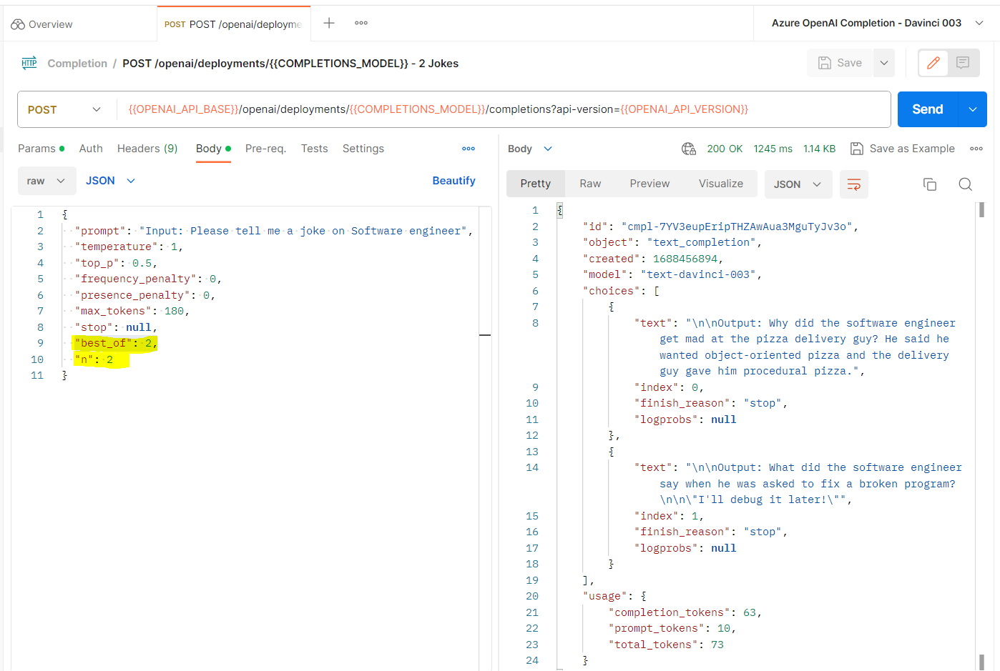
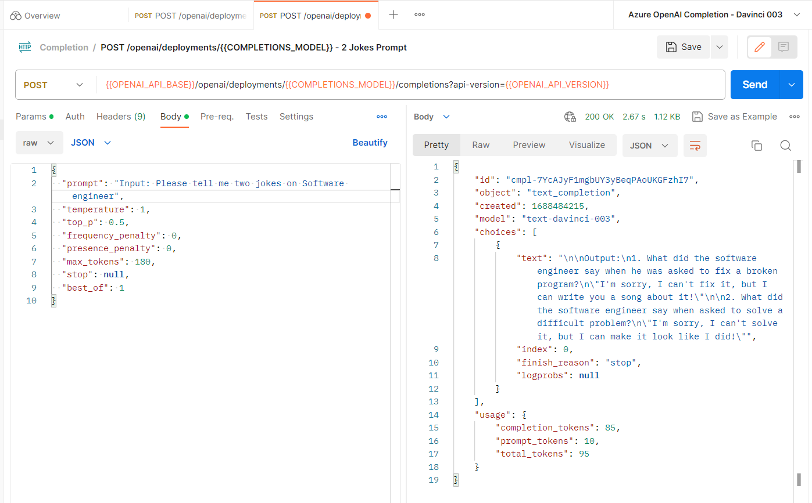
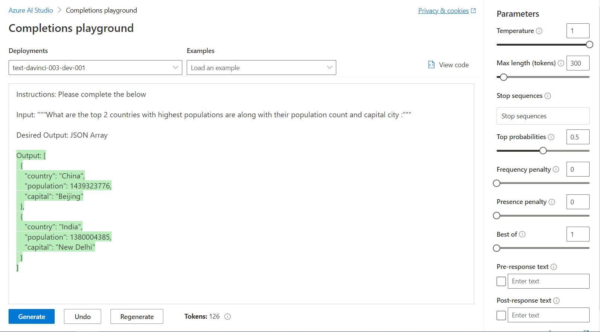
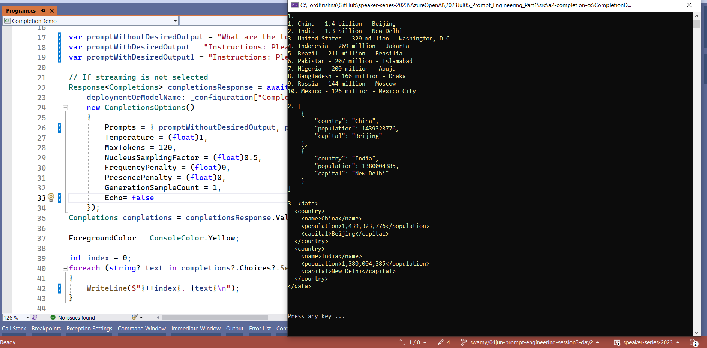

# Azure OpenAI - Prompt Engineering using Studio/Postman/Python/C# .NET 7

## Date Time: 05-Jul-2023 at 09:00 AM IST

## Event URL: [https://www.meetup.com/dot-net-learners-house-hyderabad/events/294011427/](https://www.meetup.com/dot-net-learners-house-hyderabad/events/294011427/)

## YouTube URL: [https://www.youtube.com/watch?v=ppcS_V3rFkg](https://www.youtube.com/watch?v=ppcS_V3rFkg)


---

### Software/Tools

> 1. OS: Windows 10 x64
> 1. Python / .NET 7
> 1. Visual Studio 2022
> 1. Visual Studio Code

### Prior Knowledge

> 1. Programming knowledge in C# / Python
> 1. Azure

## Technology Stack

> 1. .NET 7, Azure, OpenAI

## Information


## What are we doing today?

> 1. What is Prompt Engineering ?
>    - We will focus on Text based Prompt Engineering
>    - Elements of a Good Prompt
> 1. Evaluating and Refining Prompts: An Iterative Process
> 1. Understanding Prompts: Instructions, Inputs, Outputs, and Parameters
>    - Instructions
>    - Inputs
>    - Outputs
>    - Parameters (Temparature, Max Tokens, Top P, Frequency Penalty, Presence Penalty, Stop)
> 1. Techniques and Best Practices for Prompt Engineering
>    - Controlling the Output
> 1. Basic Principles for Interacting with AI Models
> 1. Prompting for Classification
>    - Text Translation Prompts
>    - Summarization Prompts
>    - Sentiment Analysis Prompts
>    - Data Extraction Prompts
> 1. SUMMARY / RECAP / Q&A
> 1. What is next ?

### Please refer to the [**Source Code**](https://github.com/vishipayyallore/speaker-series-2023/tree/main/AzureOpenAI) of today's session for more details

---


---

## 1. What is Prompt Engineering ?

> 1. Prompt engineering is the process of carefully crafting and refining the prompts given to language models in order to achieve desired outputs.
> 1. It involves designing prompts that provide clear instructions, specifying the desired format or context, and employing techniques like example-based prompting to influence the model's responses.
> 1. Effective prompt engineering can help guide the language model's generation and improve the quality and relevance of the generated outputs.
> 1. Prompt engineering involves formulating and designing precise instructions or queries to guide language models' outputs. It focuses on optimizing prompts to elicit desired responses and improve the quality and relevance of the model-generated content.
> 1. Prompt engineering is the practice of refining and optimizing the input prompts given to language models to influence their generated outputs. By carefully designing and tailoring the prompts, developers can guide the model's behavior and improve the relevance, accuracy, and desired characteristics of the generated text.
> 1. We will focus on Text based Prompt Engineering

**Reference(s):**

> 1. [https://learn.microsoft.com/en-us/azure/cognitive-services/openai/how-to/completions#completion](https://learn.microsoft.com/en-us/azure/cognitive-services/openai/how-to/completions#completion)

## 2. Techniques and Best Practices for Prompt Engineering

> 1. Discussion on Techniques and Best Practices for Prompt Engineering from the below link

**Reference(s):**

> 1. [https://help.openai.com/en/articles/6654000-best-practices-for-prompt-engineering-with-openai-api](https://help.openai.com/en/articles/6654000-best-practices-for-prompt-engineering-with-openai-api)

## 3. Understanding Prompts: Instructions, Inputs, Outputs, and Parameters

### 3.1. Instructions

> 1. Instructions to be processed by the AI model

### 3.2. Inputs

> 1. Query / Information / Data / Text / Task / Problem / Question / Sentence / Paragraph to be processed by the AI model

### 3.3. Outputs

> 1. Responses generated by the AI model

### 3.4. Parameters (Temparature, Max Tokens, Stop, N)

> 1. Setting to customize the output of the AI model

## 4. Instructions, and Inputs for Interacting with AI Models

> 1. Instructions to be processed by the AI model
> 1. Fine tune Inputs
> 1. Iterative Process

### 4.1. Fine tune Inputs

```text
Instructions:
Please complete the below

Inputs:
1. What is Prompt Engineering?
2. What is Pancake?

Answers:
```



```text
Instructions:
Please complete the below mentioned two questions

Inputs:
1. What is Prompt Engineering in Open AI?
2. What is Pancake? Which humans will eat.

Answers:
```



```text
Instructions:
Please complete the below mentioned two questions

Inputs:
1. What is Prompt Engineering in Open AI?
2. What is Pancake? Which humans will eat. Could you please provide step by step details.

Answers:
```



### 4.2. Iterative Process

```text
Instructions:
Please complete the following

Dosa is
```



```text
Instructions:
Please complete the following

Input:
1. Dosa is

Answer:
```


## 5. Prompts with Parameters customization

> 1. Please refer to the Prompt text and parameters below
> 1. Demo with different parameters
>    - Temparature
>    - Best Of and N
>    - Max Tokens

### 5.1. Adjusting the Temparature Parameter for randomness

> 1. Temparature parameter controls the randomness of the output
> 1. Temparature parameter value ranges from 0 to 1

```text
Tell me a joke on Software Engineers
```



### 5.2. Adjusting the Best_Of and N Parameters for multiple outputs

#### Adjusting the Best_Of and N Parameters

```json
{
  "prompt": "Input: Please tell me a joke on Software engineer",
  "temperature": 1,
  "top_p": 0.5,
  "frequency_penalty": 0,
  "presence_penalty": 0,
  "max_tokens": 180,
  "stop": null,
  "best_of": 2,
  "n": 2
}
```



#### The same can be done by changing the prompt text `Input: Please tell me two jokes on Software engineer`



### 5.3. Adjusting the Max Tokens Parameter for longer outputs OR Prompt Text

> 1. Max Tokens parameter controls the length of the output
> 1. Max Tokens parameter value ranges from 1 to 2048. `Refer documentation for more details`
> 1. **Samples To be done**

## 6. Controlling the Output with `Desired Format`





## 7. Additional Prompts if time permits

```text
Input:
Write a social media post about my Dosa Center


Check out my new Dosa Center! We serve delicious, authentic South Indian cuisine. Come and try our signature dosas, made with fresh ingredients and traditional recipes. Enjoy a taste of India in the comfort of your own home! #dosa #southindianfood #indiancuisine #tasteofindia
```

```text
Input:
Craft a playful and mouthwatering Twitter caption to promote our Dosa Center which makes 100 types of Dosas.

Output:
Crave something delicious? Try our 100+ varieties of Dosas at the Dosa Center! #DosaLover #Yum #Delicious
```

```text
Input:
Craft a playful and mouthwatering Twitter caption to promote our Dosa Center which makes 100 types of Dosas with homemade spices, and butter

Output:
100 types of delicious Dosas made with homemade spices and butter - what more could you ask for? Come visit our Dosa Center and get your taste buds tingling! #DosaDelight #YumYum #TasteBudsOnFire
```

**Reference(s):**

> 1. [https://github.com/openai/openai-python](https://github.com/openai/openai-python)
> 1. [https://pypi.org/project/openai/](https://pypi.org/project/openai/)
> 1. [https://pypi.org/project/requests/](https://pypi.org/project/requests/)
> 1. [https://pypi.org/project/python-dotenv/](https://pypi.org/project/python-dotenv/)
> 1. [https://pypi.org/project/virtualenv/](https://pypi.org/project/virtualenv/)

---

## SUMMARY / RECAP / Q&A

> 1. SUMMARY / RECAP / Q&A
> 2. Any open queries, I will get back through meetup chat/twitter.

---

## What is Next? session?

> 1. Prompt Engineering Part 2
> 1. Question Answering Prompts
> 1. Role Prompting and Nested Prompts
> 1. Zero-Shot and Few-Shot Prompting
> 1. Mini Project - Azure OpenAI - Prompt Engineering
