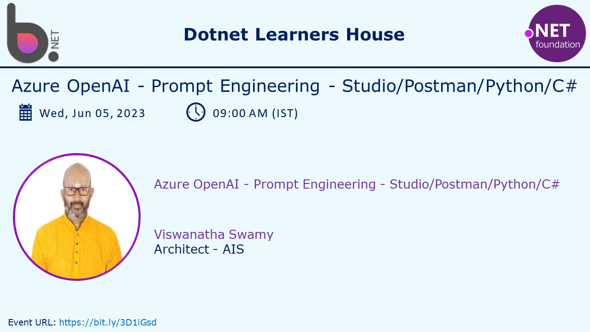

# Azure OpenAI - Prompt Engineering using Studio/Postman/Python/C# .NET 7

## Date Time: 05-Jul-2023 at 09:00 AM IST

## Event URL: [https://www.meetup.com/dot-net-learners-house-hyderabad/events/294011427/](https://www.meetup.com/dot-net-learners-house-hyderabad/events/294011427/)

## YouTube URL: [https://www.youtube.com/watch?v=ppcS_V3rFkg](https://www.youtube.com/watch?v=ppcS_V3rFkg)

---

### Software/Tools

> 1. OS: Windows 10 x64
> 1. Python / .NET 7
> 1. Visual Studio 2022
> 1. Visual Studio Code

### Prior Knowledge

> 1. Programming knowledge in C# / Python
> 1. Azure

## Technology Stack

> 1. .NET 7, Azure, OpenAI

## Information

## What are we doing today?

> 1. What is Prompt Engineering ?
>    - We will focus on Text based Prompt Engineering
>    - Elements of a Good Prompt
> 1. Evaluating and Refining Prompts: An Iterative Process
> 1. Understanding Prompts: Instructions, Inputs, Outputs, and Parameters
>    - Instructions
>    - Inputs
>    - Outputs
>    - Parameters (Temparature, Max Tokens, Top P, Frequency Penalty, Presence Penalty, Stop)
> 1. Techniques and Best Practices for Prompt Engineering
>    - Controlling the Output
> 1. Basic Principles for Interacting with AI Models
> 1. Prompting for Classification
>    - Text Translation Prompts
>    - Summarization Prompts
>    - Sentiment Analysis Prompts
>    - Data Extraction Prompts
> 1. SUMMARY / RECAP / Q&A
> 1. What is next ?

### Please refer to the [**Source Code**](https://github.com/vishipayyallore/speaker-series-2023/tree/main/AzureOpenAI) of today's session for more details

---

---

**Reference(s):**

> 1. [https://github.com/openai/openai-python](https://github.com/openai/openai-python)
> 1. [https://pypi.org/project/openai/](https://pypi.org/project/openai/)
> 1. [https://pypi.org/project/requests/](https://pypi.org/project/requests/)
> 1. [https://pypi.org/project/python-dotenv/](https://pypi.org/project/python-dotenv/)
> 1. [https://pypi.org/project/virtualenv/](https://pypi.org/project/virtualenv/)

## 1. Trying our own Completion Examples using Postman

> 1. Discussion and Demo
> 1. Import the Postman's Evniornment and Collection
> 1. Update the Environment Variables
> 1. Completion Request using Postman

**Reference(s):**

> 1. [https://learn.microsoft.com/en-us/azure/cognitive-services/openai/how-to/completions#completion](https://learn.microsoft.com/en-us/azure/cognitive-services/openai/how-to/completions#completion)

## 2. Techniques and Best Practices for Prompt Engineering

> 1. Discussion and Demo

**Reference(s):**

> 1. [https://help.openai.com/en/articles/6654000-best-practices-for-prompt-engineering-with-openai-api](https://help.openai.com/en/articles/6654000-best-practices-for-prompt-engineering-with-openai-api)

## X. Understanding Prompts: Instructions, Inputs, Outputs, and Parameters

## Instructions

> 1. Instructions to be processed by the AI model

## Inputs

> 1. Query / Information / Data / Text / Task / Problem / Question / Sentence / Paragraph to be processed by the AI model

## Outputs

> 1. Responses generated by the AI model

## Parameters (Temparature, Max Tokens, Top P, Frequency Penalty, Presence Penalty, Stop)

> 1. Setting to customize the output of the AI model

---

## SUMMARY / RECAP / Q&A

> 1. SUMMARY / RECAP / Q&A
> 2. Any open queries, I will get back through meetup chat/twitter.

---

## What is Next? session?

> 1. Prompt Engineering Part 2
> 1. Question Answering Prompts
> 1. Role Prompting and Nested Prompts
> 1. Zero-Shot and Few-Shot Prompting
> 1. Mini Project - Azure OpenAI - Prompt Engineering
