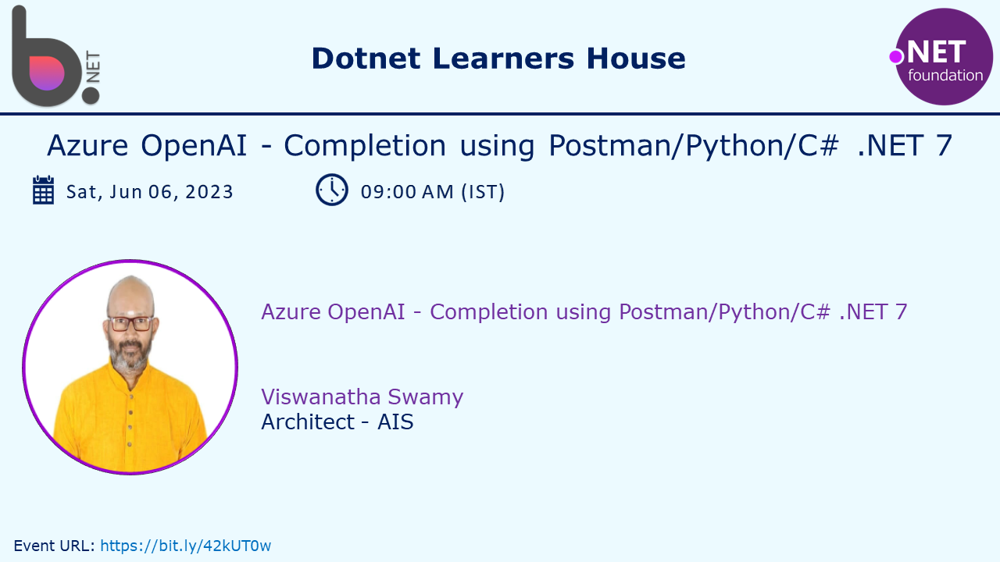
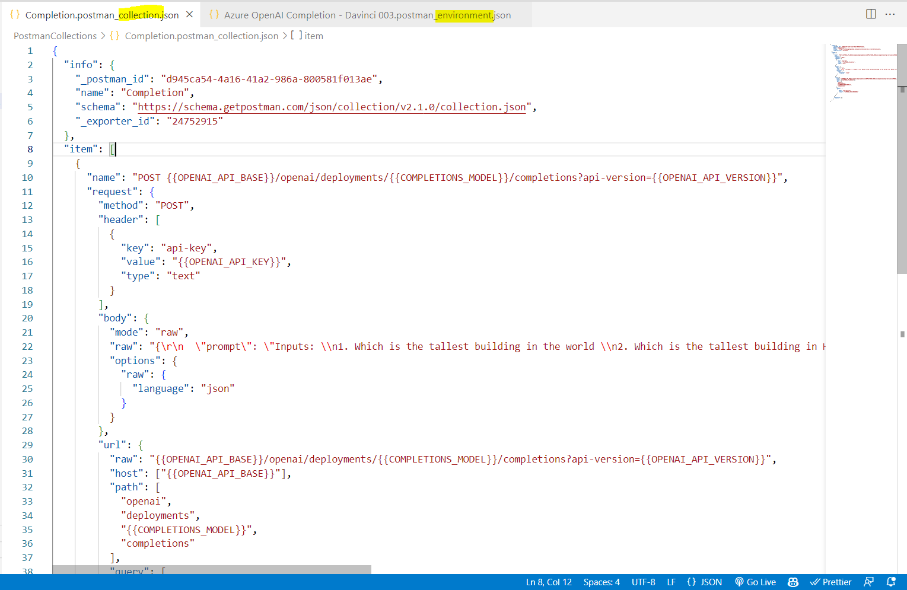
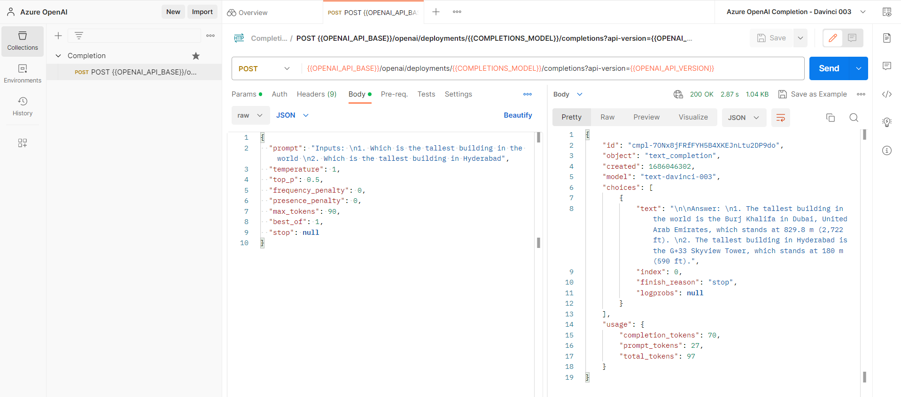

# Azure OpenAI - Completion Requests using Postman, Python, and C# .NET 7

## Date Time: 06-Jun-2023 at 09:00 AM IST

## Event URL: [https://www.meetup.com/dot-net-learners-house-hyderabad/events/293666812/](https://www.meetup.com/dot-net-learners-house-hyderabad/events/293666812/)

## YouTube URL: [https://www.youtube.com/watch?v=ppcS_V3rFkg](https://www.youtube.com/watch?v=ppcS_V3rFkg)

---

### Software/Tools

> 1. OS: Windows 10 x64
> 1. Python / .NET 7
> 1. Visual Studio 2022
> 1. Visual Studio Code

### Prior Knowledge

> 1. Programming knowledge in C# / Python
> 1. Azure

## Technology Stack

> 1. .NET 7, Azure, OpenAI

## Information

## What are we doing today?

> 1. Trying our own Completion Examples using Postman
> 1. Trying our own Completion Examples using Python Notebook
> 1. Trying our own Completion Examples using Python
> 1. Trying our own Completion Examples using C# .NET 7
> 1. SUMMARY / RECAP / Q&A
> 1. What is next ?

### Please refer to the [**Source Code**](https://github.com/vishipayyallore/speaker-series-2023/tree/main/AzureOpenAI) of today's session for more details

---

---

## 1. Trying our own Completion Examples using Postman

> 1. Discussion and Demo
> 1. Import the Postman's Evniornment and Collection
> 1. Update the Environment Variables
> 1. Completion Request using Postman

### Postman's Collection and Environment

### Postman's Evniornment

### Completion Request using Postman

---

## SUMMARY / RECAP / Q&A

> 1. SUMMARY / RECAP / Q&A
> 2. Any open queries, I will get back through meetup chat/twitter.

---

## What is Next? session?

> 1. Creating our own Docker Image
> 1. Pushing it to Docker Hub
> 1. Working with FarGate and ECS
