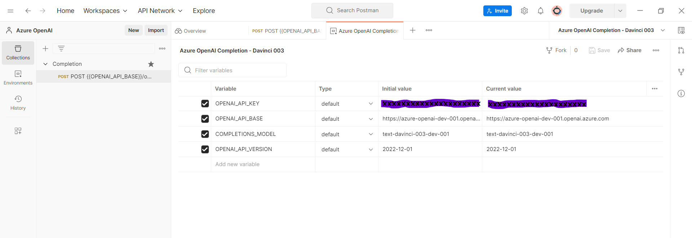
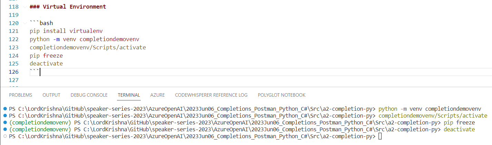

# Azure OpenAI - Completion Requests using Postman, Python, and C# .NET 7

## Date Time: 06-Jun-2023 at 09:00 AM IST

## Event URL: [https://www.meetup.com/dot-net-learners-house-hyderabad/events/293666812/](https://www.meetup.com/dot-net-learners-house-hyderabad/events/293666812/)

## YouTube URL: [https://www.youtube.com/watch?v=ppcS_V3rFkg](https://www.youtube.com/watch?v=ppcS_V3rFkg)


---

### Software/Tools

> 1. OS: Windows 10 x64
> 1. Python / .NET 7
> 1. Visual Studio 2022
> 1. Visual Studio Code

### Prior Knowledge

> 1. Programming knowledge in C# / Python
> 1. Azure

## Technology Stack

> 1. .NET 7, Azure, OpenAI

## Information


## What are we doing today?

> 1. Trying our own Completion Examples using Postman
> 1. Trying our own Completion Examples using Python Notebook
> 1. Trying our own Completion Examples using Python
> 1. Trying our own Completion Examples using C# .NET 7
> 1. SUMMARY / RECAP / Q&A
> 1. What is next ?

### Please refer to the [**Source Code**](https://github.com/vishipayyallore/speaker-series-2023/tree/main/AzureOpenAI) of today's session for more details

---


---

## 1. Trying our own Completion Examples using Postman

> 1. Discussion and Demo
> 1. Import the Postman's Evniornment and Collection
> 1. Update the Environment Variables
> 1. Completion Request using Postman

### 1.1. Postman's Collection and Environment


### 1.2. Postman's Evniornment



### 1.3. Completion Request using Postman


## 2. Trying our own Completion Examples using Python Notebook

> 1. Discussion and Demo
> 1. Install `openai`, `requests`, and `python-dotenv` packages
> 1. Create a .env file and update the Environment Variables
> 1. Completion Request using Python Notebook
> 1. Execute the Python Notebook

**Reference(s):**

> 1. [https://github.com/openai/openai-python](https://github.com/openai/openai-python)
> 1. [https://pypi.org/project/openai/](https://pypi.org/project/openai/)
> 1. [https://pypi.org/project/requests/](https://pypi.org/project/requests/)
> 1. [https://pypi.org/project/python-dotenv/](https://pypi.org/project/python-dotenv/)

### 2.1. Install `openai`, `requests` packages

```powershell
pip install openai
pip install requests
pip install python-dotenv
```

### 2.2. Create a .env file and update the Environment Variables

```text
COMPLETIONS_MODEL="text-davinci-003-dev-001"
OPENAI_API_BASE="https://<your resource name>.openai.azure.com"
OPENAI_API_VERSION="2022-12-01"
OPENAI_API_KEY=YourAPIKEY-11x1x111111x1xxx1x111x1x11x11x1x
```

### 2.3. Execute the Python Notebook


## 3. Trying our own Completion Examples using Python

> 1. Discussion and Demo
> 1. Create `Virtual Environment`
> 1. Install `openai`, `requests`, and `python-dotenv` packages
> 1. Create a .env file and update the Environment Variables
> 1. Completion Request using Python
> 1. Execute the Python Script

**Reference(s):**

> 1. [https://pypi.org/project/virtualenv/](https://pypi.org/project/virtualenv/)

### 3.1. Virtual Environment

```bash
pip install virtualenv
python -m venv completiondemovenv
completiondemovenv/Scripts/activate
pip freeze
deactivate
```



### 3.2. Install `openai`, `requests` packages

```powershell
pip install openai
pip install requests
pip install python-dotenv
```


### 3.3. Create a .env file and update the Environment Variables

```text
COMPLETIONS_MODEL="text-davinci-003-dev-001"
OPENAI_API_BASE="https://<your resource name>.openai.azure.com"
OPENAI_API_VERSION="2022-12-01"
OPENAI_API_KEY=YourAPIKEY-11x1x111111x1xxx1x111x1x11x11x1x
```

### 3.4. Execute the Python Script

> 1. Discussion and Demo


---

## SUMMARY / RECAP / Q&A

> 1. SUMMARY / RECAP / Q&A
> 2. Any open queries, I will get back through meetup chat/twitter.

---

## What is Next? session?

> 1. Creating our own Docker Image
> 1. Pushing it to Docker Hub
> 1. Working with FarGate and ECS
