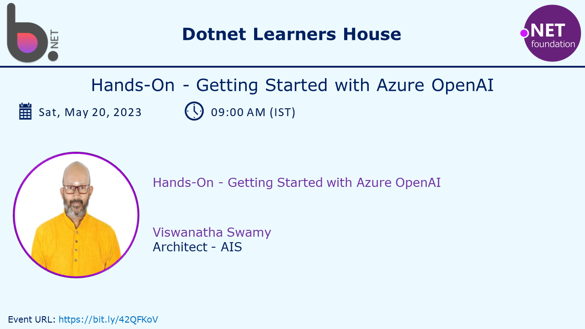

# Hands-On - Getting Started with Azure OpenAI

## Date Time: 20-May-2023 at 09:00 AM IST

## Event URL: [https://www.meetup.com/dot-net-learners-house-hyderabad/events/293318064](https://www.meetup.com/dot-net-learners-house-hyderabad/events/293318064)

## YouTube URL: [https://www.youtube.com/watch?v=Kgz_Qgsgp_Q](https://www.youtube.com/watch?v=Kgz_Qgsgp_Q)



---

### Software/Tools

> 1. OS: Windows 10 x64
> 1. Python / .NET 7
> 1. Visual Studio 2022
> 1. Visual Studio Code

### Prior Knowledge

> 1. Programming knowledge in C# / Python
> 1. Azure

## Technology Stack

> 1. .NET 7, Azure, OpenAI

## Information


## What are we doing today?

> 1. 30,000 foot view of Azure OpenAI
>    - What is Azure OpenAI Service?
>    - Azure OpenAI Service quotas and limits
>    - Azure OpenAI Service models
> 1. 30,000 foot view of Azure AI Studio
>    - What is Azure AI Studio?
>    - Trying couple of Examples in Azure AI Studio
> 1. Hands-on with FarGate/ECD using `Razor Web App` on AWS Console
> 1. SUMMARY / RECAP / Q&A
> 1. What is next ?

### Please refer to the [**Source Code**](https://github.com/vishipayyallore/speaker-series-2023/tree/main/AzureOpenAI) of today's session for more details

---


---

## 1. 30,000 foot view of Docker

> 1. Discussion and Demo

**References:**

> 1. [https://docs.docker.com/get-started/overview/](https://docs.docker.com/get-started/overview/)

### Docker architecture

> 1. Discussion and Demo

### The Docker daemon

> 1. Discussion and Demo

### The Docker client

> 1. Discussion and Demo

### The Docker Images

> 1. Discussion and Demo

### The Docker Containers

> 1. Discussion and Demo

### The Docker Images Registry

> 1. Discussion and Demo

## 2. Hands-on with Docker using `nginx` on Local Machine

> 1. Discussion and Demo

**References:**

> 1. [https://hub.docker.com/_/nginx](https://hub.docker.com/_/nginx)


## 3. Hands-on with Docker using `Razor Web App` on Local Machine

> 1. Discussion and Demo

**References:**

> 1. [https://hub.docker.com/repository/docker/vishipayyallore/booksstoreweb/general](https://hub.docker.com/repository/docker/vishipayyallore/booksstoreweb/general)


```dockercmd
docker pull vishipayyallore/booksstoreweb:latest
```


## 4. 30,000 foot view of ECS / Just Enough ECS

> 1. Discussion and Demo

**References:**

> 1. [https://docs.aws.amazon.com/ecs/index.html](https://docs.aws.amazon.com/ecs/index.html)
> 1. [https://docs.aws.amazon.com/AmazonECS/latest/developerguide/launch_types.html](https://docs.aws.amazon.com/AmazonECS/latest/developerguide/launch_types.html)

## Hands-on with FarGate/ECS using `nginx` on AWS Console

> 1. Discussion and Demo

## Hands-on with FarGate/ECS using `Razor Web App` on AWS Console

> 1. Discussion and Demo


---

## SUMMARY / RECAP / Q&A

> 1. SUMMARY / RECAP / Q&A
> 2. Any open queries, I will get back through meetup chat/twitter.

---

## What is Next? session?

> 1. Creating our own Docker Image
> 1. Pushing it to Docker Hub
> 1. Working with FarGate and ECS
