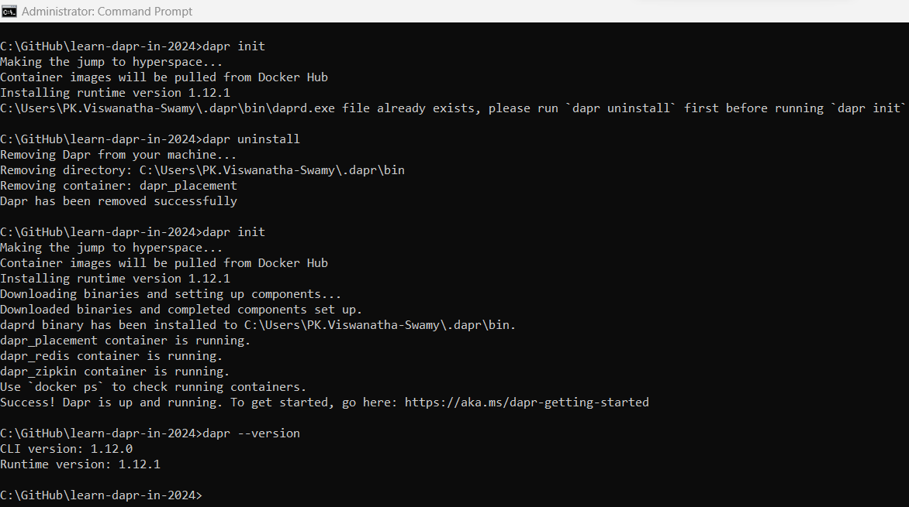
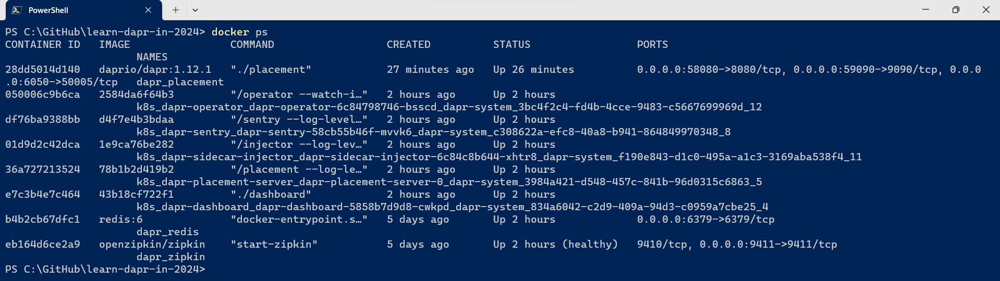

# Getting started - Dapr (Distributed Application Runtime), .NET 8, and VS Code

## Date Time: 18-Nov-2023 at 09:00 AM IST

## Event URL: [https://www.meetup.com/dot-net-learners-house-hyderabad/events/296030335](https://www.meetup.com/dot-net-learners-house-hyderabad/events/296030335)

## YouTube URL: [https://www.youtube.com/watch?v=ToBeDone](https://www.youtube.com/watch?v=ToBeDone)


---

### Software/Tools

> 1. OS: Windows 10/11 x64
> 1. .NET 8
> 1. Visual Studio 2022
> 1. Visual Studio Code

### Prior Knowledge

> 1. Programming knowledge in C#
> 1. Azure

## Technology Stack

> 1. .NET 8, dapr, VS Code

## Information


## What are we doing today?

> 1. To be decided
> 1. SUMMARY / RECAP / Q&A

### Please refer to the [**Source Code**](https://github.com/ViswanathaSwamy-PK-TechSkillz-Academy/learn-azure-openai) of today's session for more details

---


---

## 1. Distributed Systems

> 1. Discussion
> 1. Monolithic architecture
> 1. SOA architecture
> 1. Distributed architecture
> 1. <https://learn.microsoft.com/en-us/dotnet/architecture/dapr-for-net-developers/the-world-is-distributed>

## 2. Dapr from 30,000 feet

> 1. Discussion
> 1. Dapr architecture
> 1. Components
> 1. Sidecar architecture
> 1. Hosting environments
> 1. <https://learn.microsoft.com/en-us/dotnet/architecture/dapr-for-net-developers/dapr-at-20000-feet>

## 3. Let's enter into the World of Dapr

> 1. Discussion and Demo
> 1. Install Dapr CLI <https://docs.dapr.io/getting-started/install-dapr-cli/>
> 1. <https://github.com/dapr/cli/releases>
> 1. Verify Dapr CLI installation

```bash
dapr
```


## 4. Initialize Dapr in your local environment

> 1. Discussion and Demo
> 1. Install Dapr runtime <https://docs.dapr.io/getting-started/install-dapr-selfhost/>
> 1. We should execute the commands in elevated command prompt

```bash
dapr uninstall
dapr init
dapr --version
```



## 5. Verify components directory has been initialized

> 1. Discussion and Demo

```bash
%UserProfile%\.dapr
```


## 6. Verify containers are running

> 1. Discussion and Demo

```bash
docker ps
```



## 7. Viewing the Dapr Dashboard

> 1. Discussion and Demo
> 1. Install Dapr dashboard <https://docs.dapr.io/getting-started/install-dapr-dashboard/>


## 8. Creating our first Dapr application - (ASP.NET Core Web API)

> 1. Discussion and Demo

---

## SUMMARY / RECAP / Q&A

> 1. SUMMARY / RECAP / Q&A
> 2. Any open queries, I will get back through meetup chat/twitter.

---

## What is Next? session?

> 1. To be decided

## XX. Creating our first Dapr application - (Console)

> 1. Discussion and Demo

```bash
dotnet new console -o DaprCounter

cd DaprCounter

dotnet run

dotnet add package Dapr.Client

dapr run --app-id DaprCounter dotnet run

dapr run --app-id DaprCounter dotnet run
```

```csharp
using Dapr.Client

const string storeName = "statestore";
const string key = "counter"

var daprClient = new DaprClientBuilder().Build();
var counter = await daprClient.GetStateAsync<int>(storeName, key)

while (true)
{
    Console.WriteLine($"Counter = {counter++}")
    await daprClient.SaveStateAsync(storeName, key, counter);
    await Task.Delay(1000);
}
```
