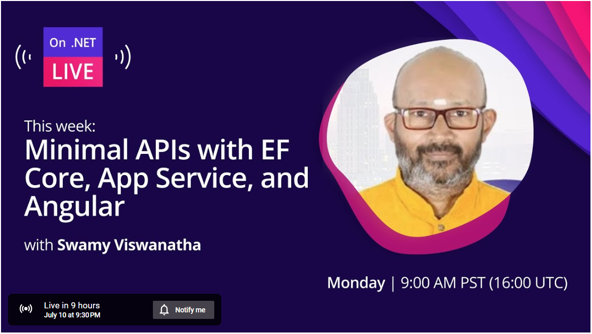
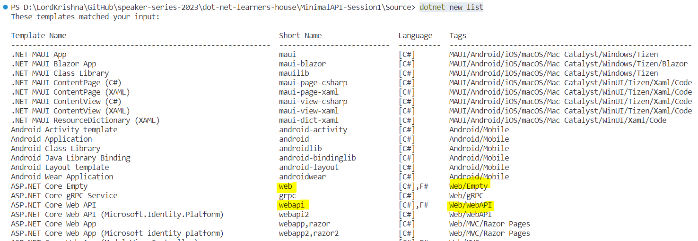
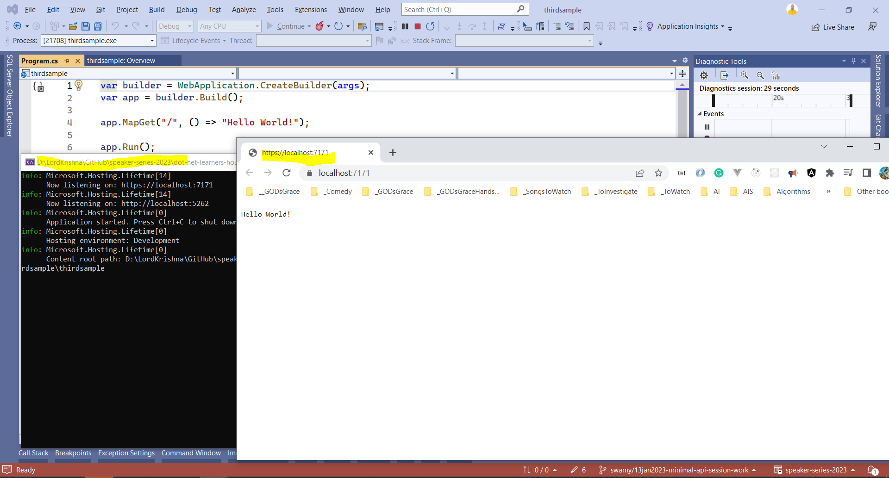
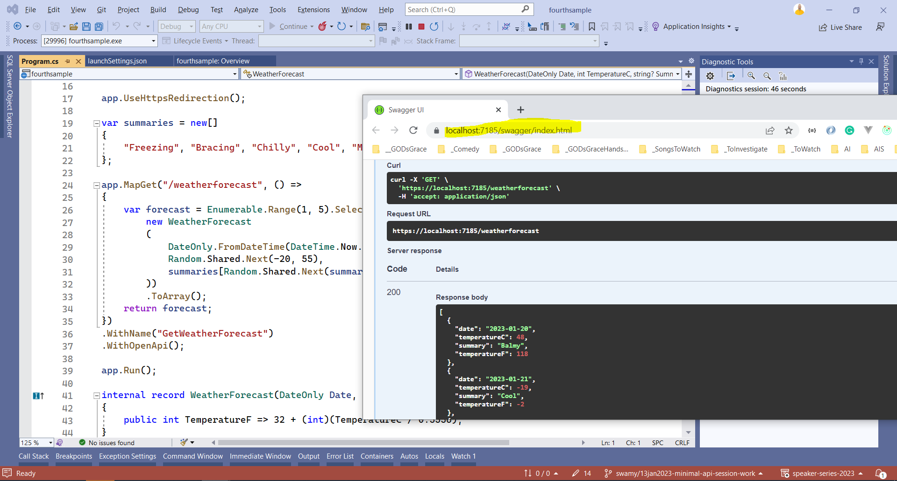

# Minimal APIs with EF Core, App Service, and Angular in On .NET Live

## Date Time: 10-Jul-2023 at 09:30 PM IST

## YouTube URL: [https://www.youtube.com/watch?v=MUuyd5RVJe4](https://www.youtube.com/watch?v=MUuyd5RVJe4)



---

### Software/Tools

> 1. OS: Windows 10 x64
> 1. .NET 7
> 1. Visual Studio 2022
> 1. Visual Studio Code

### Prior Knowledge

> 1. Programming knowledge in C#
> 1. Azure
> 1. Angular 15
> 1. .NET REST API

## Technology Stack

> 1. .NET 7, Azure, and Angular 15

## Information


## What are we doing today?

> 1. Introduction to .NET Minimal API
> 1. Comparision of Service Collections
>    - Web App Empty | Web API with Uncheck Controllers | Web API with Controllers
> 1. Comparison of HTTP Request Pipeline
>    - Web App Empty | Web API with Uncheck Controllers | Web API with Controllers
> 1. Parameter Binding demo with User Endpoints
>    - From Query | From Route | From Body | From Services
> 1. Base Entity - Course Entity inheriting Base Entity
> 1. Dependency Injection and Inversion of Control - Deep Dive
>    - Dependency Injection of DbContext, Auto Mapper, Swagger, Repository Layer, Business Layer
> 1. Returning Unified Response from different Endpoints
> 1. Move the Endpoints into an Extension Classes
> 1. Creating Course Dtos using record, and Auto Mapper Configuration - Enhancing GetAllCourses() API Endpoint to return Course Dtos
> 1. Adding Swagger Dependencies - WithTags().WithName().Produces(200).ProducesProblem(500);
> 1. Move Service Dependencies, and Http Request Pipeline Dependencies into a Extension Classes
> 1. Logging using Serilog
> 1. Configuration CORS in Development Mode
> 1. Angular 15 (SPA with Standalone components) integration with Minimal API Only GetAllCourses() Local API Endpoint
> 1. Angular 15 (SPA with Standalone components) integration with Minimal API Only GetAllCourses() Azure Hosted API Endpoint
> 1. SUMMARY / RECAP / Q&A
> 1. 30,000 foot view of HTTP, and REST

### Please refer to the [**Source Code**](https://github.com/Microservices-for-Small-School-App/services-school) of today's session for more details

---


---

## 1. Introduction to .NET Minimal API

**References:**

> 1. [https://learn.microsoft.com/en-us/aspnet/core/fundamentals/minimal-apis/overview?view=aspnetcore-7.0](https://learn.microsoft.com/en-us/aspnet/core/fundamentals/minimal-apis/overview?view=aspnetcore-7.0)

## 2. How to create .NET Minimal API?

### 2.1. Create a new .NET Minimal API project using `dotnet cli` command

```powershell
dotnet new list

dotnet new web -o firstsample --dry-run

dotnet new webapi -minimal -o secondsample --dry-run
```



### 2.1. Create a new .NET Minimal API project using `VS 2022` command

#### Create Minimal API using `VS 2022` - Web App Empty Template



#### Create Minimal API using `VS 2022` - Web API Template - Uncheck Controllers



## 3. Comparision of Service Collections

### 3.1. Web App Empty | Web API with Uncheck Controllers | Web API with Controllers

> 1. Comparision bewteen Web
>    - Web App Empty
>    - Web API with Uncheck Controllers
>    - Web API with Controllers

## 4. Comparison of HTTP Request Pipeline

**References:**

> 1. [https://learn.microsoft.com/en-us/aspnet/core/fundamentals/middleware/?view=aspnetcore-7.0](https://learn.microsoft.com/en-us/aspnet/core/fundamentals/middleware/?view=aspnetcore-7.0)
> 1. [https://learn.microsoft.com/en-us/aspnet/core/fundamentals/middleware/write?view=aspnetcore-7.0](https://learn.microsoft.com/en-us/aspnet/core/fundamentals/middleware/write?view=aspnetcore-7.0)

---

## SUMMARY / RECAP / Q&A

> 1. SUMMARY / RECAP / Q&A
> 2. Any open queries, I will get back through meetup chat/twitter.

---

## Appendix A

### 1. 30,000 foot view of HTTP, and REST

**References:**

> 1. [https://rapidapi.com/blog/rest-api-vs-web-api](https://rapidapi.com/blog/rest-api-vs-web-api)
> 1. [https://www.guru99.com/api-vs-web-service-difference.html#:~:text=Web%20service%20is%20used%20for,APIs%20are%20not%20web%20services.](https://www.guru99.com/api-vs-web-service-difference.html#:~:text=Web%20service%20is%20used%20for,APIs%20are%20not%20web%20services.)
> 1. [https://developer.mozilla.org/en-US/docs/Web/HTTP/Methods](https://developer.mozilla.org/en-US/docs/Web/HTTP/Methods)
> 1. [https://developer.mozilla.org/en-US/docs/Web/HTTP/Status/200](https://developer.mozilla.org/en-US/docs/Web/HTTP/Status/200)
> 1. [https://developer.mozilla.org/en-US/docs/Web/HTTP/Methods/PUT](https://developer.mozilla.org/en-US/docs/Web/HTTP/Methods/PUT)
> 1. [https://en.wikipedia.org/wiki/Representational_state_transfer](https://en.wikipedia.org/wiki/Representational_state_transfer)

### HTTP Methods

> 1. Discussion and Demo

### HTTP Responses

> 1. Discussion and Demo

### What should I send as Response

> 1. Discussion and Demo

### REST (Uniform, Stateless, Cacheable, Layered, Resources, and Self-Descriptive)

> 1. Discussion and Demo
