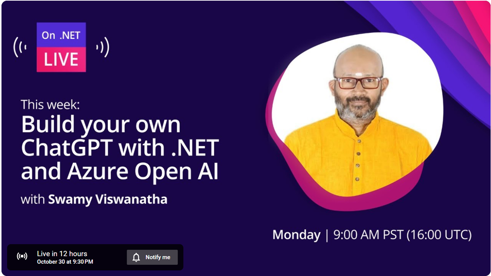

# Build your own ChatGPT with .NET and Azure Open AI at [On .NET Live](https://dotnet.microsoft.com/en-us/live/on-dotnet-live)

## Date Time: 30-Oct-2023 at 09:30 PM IST

## YouTube URL: [https://www.youtube.com/watch?v=3r7bR5ZEJp4](https://www.youtube.com/watch?v=3r7bR5ZEJp4)

---

### Software/Tools

> 1. OS: Windows 10 x64
> 1. .NET 8
> 1. Visual Studio 2022
> 1. Visual Studio Code

### Prior Knowledge

> 1. Programming knowledge in C# / Python
> 1. Azure / Azure Open AI / Open AI
> 1. .NET REST API

## Technology Stack

> 1. .NET 8, Azure, and Azure Open AI

## Information

## What are we doing today?

> 1. To be decided
> 1. SUMMARY / RECAP / Q&A

### Please refer to the [**Source Code**](https://github.com/Microservices-for-Small-School-App/services-school) of today's session for more details

---

---

## 1. Introduction to .NET Minimal API

**References:**

> 1. [https://learn.microsoft.com/en-us/aspnet/core/fundamentals/minimal-apis/overview?view=aspnetcore-7.0](https://learn.microsoft.com/en-us/aspnet/core/fundamentals/minimal-apis/overview?view=aspnetcore-7.0)

## 2. How to create .NET Minimal API?

### 2.1. Create a new .NET Minimal API project using `dotnet cli` command

---

## SUMMARY / RECAP / Q&A

> 1. SUMMARY / RECAP / Q&A
> 2. Any open queries, I will get back through meetup chat/twitter.

---

## Appendix A

### 1. To be decided

**References:**

> 1. [https://rapidapi.com/blog/rest-api-vs-web-api](https://rapidapi.com/blog/rest-api-vs-web-api)
