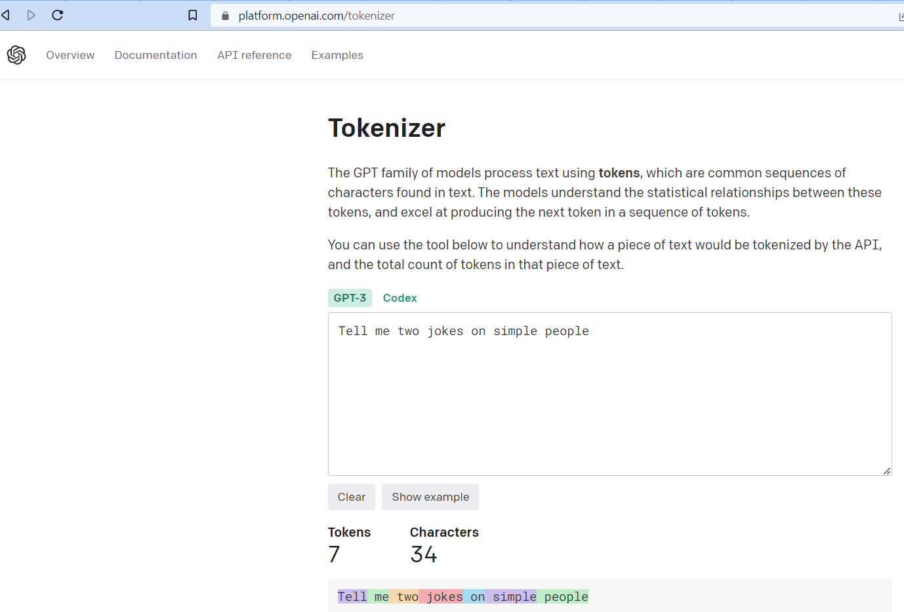
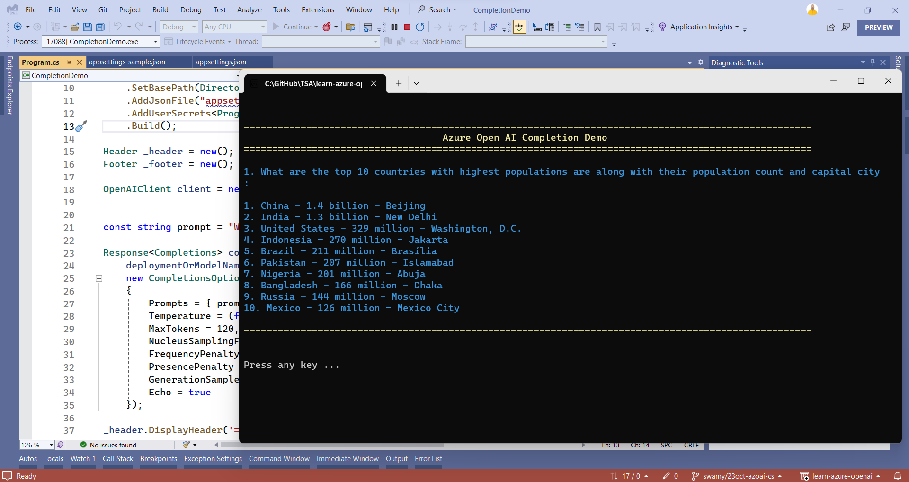
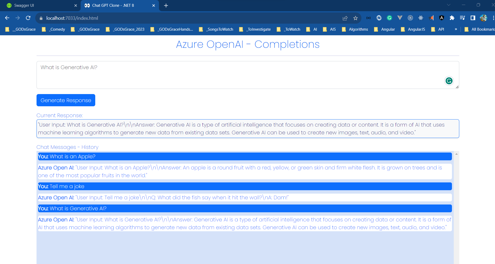

# Build your own ChatGPT with .NET and Azure Open AI at [On .NET Live](https://dotnet.microsoft.com/en-us/live/on-dotnet-live)

## Date Time: 30-Oct-2023 at 09:30 PM IST

## YouTube URL: [https://www.youtube.com/watch?v=3r7bR5ZEJp4](https://www.youtube.com/watch?v=3r7bR5ZEJp4)


---

### Software/Tools

> 1. OS: Windows 10 x64
> 1. .NET 8
> 1. Visual Studio 2022
> 1. Visual Studio Code

### Prior Knowledge

> 1. Programming knowledge in C# / Python
> 1. Azure / Azure Open AI / Open AI
> 1. .NET REST API

## Technology Stack

> 1. .NET 8, Azure, and Azure Open AI

## Information


## What are we doing today?

> 1. What is Intelligence?
> 1. Few Terms AI, ML, Auto ML, DL, NLP, GAI
> 1. ELIZA - The early Natural Language Processing (NLP) Chatbot
> 1. Azure Open AI, Transformer and GPT
> 1. Tokens Tokens Tokens and more Tokens
> 1. Trying our own Completion Examples in Azure AI Studio
> 1. Create a .env file and update the Environment Variables
> 1. Completion Request using C# .NET 8
> 1. Our Own ChatGPT with .NET 8 and Azure Open AI
> 1. SUMMARY / RECAP / Q&A

### Please refer to the [**Source Code**](https://github.com/vishipayyallore/speaker-series-2023/tree/main/On.NETLiveShows/20231030_BuildYourOwnChatGPT) of today's session for more details

---


---

## 1. What is Intelligence?

> 1. Discussion

## 2. Few Terms AI, ML, Auto ML, DL, NLP, GAI

> 2.1. **Artificial Intelligence (AI):**
>
> - AI refers to the broader field of computer science focused on creating machines and software that can perform tasks that typically require human intelligence.
> - It encompasses various techniques and approaches, including machine learning and deep learning, to enable systems to reason, learn, perceive, and solve complex problems.
> - Strong / General AI => Do lots of things
> - Narrow / Weak AI => Perform specific things

---

> 2.2. **Machine Learning (ML):**
>
> - ML is a subset of AI that involves the development of algorithms and models that allow computers to learn from data and make predictions or decisions without being explicitly programmed.
> - ML includes supervised learning, unsupervised learning, and reinforcement learning, among others, and finds applications in areas like image recognition and recommendation systems.
> - Data Collection | Data Preparation | Model Selection | Train Model | Evaluate Model | Parameter tuning | Prediction | (GAI => New Content)

---

> 2.3. **Deep Learning (DL):**
>
> - DL is a subfield of ML that focuses on neural networks with many layers (deep neural networks). It excels in handling complex, high-dimensional data, such as images and text.
> - DL has led to breakthroughs in areas like computer vision, natural language processing, and speech recognition, and it relies on large datasets and powerful hardware like GPUs.

---

> 2.4. **Natural Language Processing (NLP):**
>
> - NLP is a branch of AI that deals with the interaction between computers and human language. It enables machines to understand, interpret, and generate human language.
> - NLP is used in chatbots, sentiment analysis, machine translation, and more, and it involves tasks like tokenization, part-of-speech tagging, and language generation.

---

> 2.5. **Generative AI:**
>
> - Generative AI refers to AI systems capable of generating new, original content, such as text, images, or music, often with some level of creativity.
> - It includes techniques like Generative Adversarial Networks (GANs) and variational autoencoders (VAEs), which have applications in art generation, content creation, and data augmentation.
> - 1.1. **Generative Adversarial Networks (GANs):**
>   - GANs are a class of deep learning models consisting of two neural networks, a generator, and a discriminator, which are trained simultaneously through a competitive process.
>   - The generator aims to create data (e.g., images) that is indistinguishable from real data, while the discriminator tries to distinguish between real and generated data. This adversarial training process results in the generation of high-quality, realistic data and has applications in image generation, style transfer, and more.
> - 1.2. **Variational Autoencoders (VAEs):**
>   - VAEs are another type of generative model used in unsupervised learning. They consist of an encoder network that maps input data into a latent space and a decoder network that reconstructs data from the latent space.
>   - VAEs are used for generating new data samples and learning meaningful representations of data. They are particularly useful in applications like image generation, anomaly detection, and data compression due to their ability to generate diverse and structured data from a continuous latent space.

## 3. ELIZA - The early Natural Language Processing (NLP) Chatbot

> **ELIZA:**
>
> - ELIZA is one of the earliest and most well-known examples of a natural language processing (NLP) chatbot. Developed in the mid-1960s by Joseph Weizenbaum at the Massachusetts Institute of Technology (MIT), ELIZA was designed to simulate a Rogerian psychotherapist. Its primary purpose was to engage users in conversation and provide responses based on simple pattern recognition.
> - It was one of the first chatbots to use natural language processing techniques to simulate human conversation.
> - ELIZA demonstrated that even with relatively simple pattern-matching techniques, a computer program could engage users in meaningful conversations. While it was limited in its capabilities compared to modern chatbots, it was a pioneering step in the field of NLP and human-computer interaction.

Reference(s):

> 1. [https://en.wikipedia.org/wiki/ELIZA](https://en.wikipedia.org/wiki/ELIZA)

## 4. Azure Open AI, Transformer and GPT

> 4.1. **Azure Open AI:**
>
> - Azure OpenAI is a cloud-based service provided by Microsoft Azure that offers access to the power of OpenAI's language models, such as GPT-3, GPT-4, and others. It enables developers to integrate natural language understanding and text generation capabilities into their applications and services. Azure OpenAI is designed for a wide range of use cases, including chatbots, content generation, language translation, and more, and it offers scalable and efficient access to advanced AI language capabilities via a RESTful API. It provides developers with the tools they need to build intelligent, language-driven applications.

---

> 4.2. **Transformer:**
>
> - A "Transformer" in the context of artificial intelligence and machine learning is not a physical device but a type of deep learning model architecture that has had a significant impact on various natural language processing (NLP) tasks and other machine learning domains.
> - These topics are interconnected, with AI being the overarching field that encompasses various subfields like ML, DL, NLP, and Generative AI. Each of these subfields has its own set of techniques and applications, contributing to the advancement of artificial intelligence.

---

> 4.2. **GPT - Generative Pre-trained Transformer:**
>
> - The term "GPT" stands for "Generative Pre-trained Transformer." It refers to a class of deep learning models used for various natural language processing (NLP) tasks. These models are characterized by their ability to generate human-like text and their architecture, which is based on the Transformer neural network.
>   - **Generative**: GPT models are capable of generating human-readable text. They can be used for tasks like text completion, text summarization, and even creative writing.
>   - **Pre-trained**: GPT models are initially trained on a large corpus of text data from the internet. This pre-training phase allows them to learn grammar, context, and world knowledge from a wide range of sources.
>   - **Transformer**: The underlying architecture of GPT models is the Transformer, which is a neural network architecture introduced in the paper "Attention Is All You Need" by Vaswani et al. in 2017. The Transformer architecture relies on the self-attention mechanism, which allows the model to consider the context and relationships between words in a sequence efficiently.
> - GPT models, such as GPT-3, GPT-4, and others, have achieved remarkable performance in various NLP tasks and have been widely adopted in the field of artificial intelligence. They have applications in natural language understanding, text generation, language translation, chatbots, and more.

---

## 5. Tokens Tokens Tokens and more Tokens

> 1. Discussion and Demo

**References:**

> 1. [https://platform.openai.com/tokenizer](https://platform.openai.com/tokenizer)



## 6. Trying our own Completion Examples in Azure AI Studio

> 1. Discussion and Demo

```text
Input:
Happy Birthday

Input:
Tell me two jokes on Innocent people

Input:
Give the top 5 food items from South India

Input:
Give the top 5 Populated states in India

Inputs:
1. Which is the tallest building in the world
2. Which is the tallest building in Hyderabad

```


## 7. Create a .env file and update the Environment Variables

```text
COMPLETIONS_MODEL="text-davinci-003-dev-001"
OPENAI_API_BASE="https://<your resource name>.openai.azure.com"
OPENAI_API_VERSION="2022-12-01"
OPENAI_API_KEY=YourAPIKEY-11x1x111111x1xxx1x111x1x11x11x1x
```

```powershell
[System.Environment]::SetEnvironmentVariable('OPENAI_API_KEY', 'YourAPIKEY-11x1x111111x1xxx1x111x1x11x11x1x', 'User')
```

## 8. Completion Request using C# .NET 8

> 1. Discussion and Demo



## 9. Our Own ChatGPT with .NET 8 and Azure Open AI

> 1. Discussion and Demo



## SUMMARY / RECAP / Q&A

> 1. SUMMARY / RECAP / Q&A
> 2. Any open queries, I will get back through meetup chat/twitter.

---

## Appendix A

### 1. To be decided

**References:**

> 1. [https://rapidapi.com/blog/rest-api-vs-web-api](https://rapidapi.com/blog/rest-api-vs-web-api)
