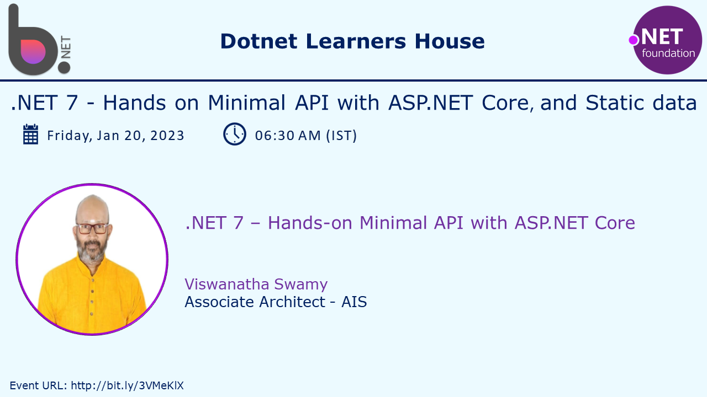

# .NET 7 - Hands-on Minimal API with ASP.NET Core and Static data

## Date Time: 20-Jan-2023 at 06:30 AM IST

## Event URL: [https://www.meetup.com/dot-net-learners-house-hyderabad/events/290536063](https://www.meetup.com/dot-net-learners-house-hyderabad/events/290536063)

---

### Software/Tools

> 1. OS: Windows 10 x64
> 1. .NET 7
> 1. Visual Studio 2022
> 1. Visual Studio Code

### Prior Knowledge

> 1. Programming knowledge in C#
> 1. Azure
> 1. Angular 15
> 1. .NET Razor/Blazor WASM

## Technology Stack

> 1. .NET 7, Azure

## Information

## What are we doing today?

> 1. 30,000 foot view of REST, and HTTP
>    - REST (Uniform, Stateless, Cacheable, Layered, Resources, and Self-Descriptive)
>    - HTTP Methods
>    - HTTP Responses
>    - What should I send as Response
> 1. Introduction to .NET Minimal API
> 1. Two Ways to create Minimal API using `VS 2022`
>    - Web API with UnCheck Controllers
>    - Web App Empty
> 1. Creating Minimal API using dotnet CLI
>    - `dotnet new webapi -minimal`
> 1. Executing it using IIS Express, and Kestrel Server (http, https)
> 1. Exploring Swagger
> 1. Exposing 4 `Hello World` API Endpoints
> 1. Creating Unified Response Dto, and Constants
> 1. Using Postman to test the API (Environment Variables, and Collections)
> 1. Layered Architecture
> 1. Testing using
>    - Swagger
>    - Postman
>    - Browser Dev Tools

### Please refer to the [**Source Code**](https://github.com/vishipayyallore/learn-azure-in-2022) of today's session for more details

---

---

## 1. 30,000 foot view of HTTP, and REST

> 1. Discussion and Demo

**References:**

> 1. [https://rapidapi.com/blog/rest-api-vs-web-api](https://rapidapi.com/blog/rest-api-vs-web-api)
> 1. [https://www.guru99.com/api-vs-web-service-difference.html#:~:text=Web%20service%20is%20used%20for,APIs%20are%20not%20web%20services.](https://www.guru99.com/api-vs-web-service-difference.html#:~:text=Web%20service%20is%20used%20for,APIs%20are%20not%20web%20services.)
> 1. [https://developer.mozilla.org/en-US/docs/Web/HTTP/Methods](https://developer.mozilla.org/en-US/docs/Web/HTTP/Methods)
> 1. [https://developer.mozilla.org/en-US/docs/Web/HTTP/Status/200](https://developer.mozilla.org/en-US/docs/Web/HTTP/Status/200)
> 1. [https://developer.mozilla.org/en-US/docs/Web/HTTP/Methods/PUT](https://developer.mozilla.org/en-US/docs/Web/HTTP/Methods/PUT)

### HTTP Methods

> 1. Discussion and Demo

### HTTP Responses

> 1. Discussion and Demo

### What should I send as Response

> 1. Discussion and Demo

### REST (Uniform, Stateless, Cacheable, Layered, Resources, and Self-Descriptive)

> 1. Discussion and Demo

**References:**

> 1. [https://en.wikipedia.org/wiki/Representational_state_transfer](https://en.wikipedia.org/wiki/Representational_state_transfer)

## 2. Introduction to .NET Minimal API

> 1. Discussion and Demo

**References:**

> 1. [https://learn.microsoft.com/en-us/aspnet/core/fundamentals/minimal-apis/overview?view=aspnetcore-7.0](https://learn.microsoft.com/en-us/aspnet/core/fundamentals/minimal-apis/overview?view=aspnetcore-7.0)

## 3. Creating Minimal API using dotnet CLI

> 1. Discussion and Demo

### Create Minimal API using `dotnet new webapi -minimal`

> 1. Discussion and Demo

### Executing it using VS Code (dotnet CLI)

> 1. Discussion and Demo

## 4. Two Ways to create Minimal API using `VS 2022`

> 1. Discussion and Demo

### Web API with UnCheck Controllers

> 1. Discussion and Demo

### Web App Empty

> 1. Discussion and Demo

## 5. Executing it using IIS Express, and Kestrel Server (http, https)

> 1. Discussion and Demo. This is part of Section 3 and 4.

## 6. Exploring Swagger

> 1. Discussion and Demo. This is part of Section 3.1.

## 7. Exposing 4 `Hello World` API Endpoints

> 1. Discussion and Demo

## 8. Creating Unified Response Dto, and Constants

> 1. Discussion and Demo

## 9. Using Postman to test the API (Environment Variables, and Collections)

> 1. Discussion and Demo

## 10. Layered Architecture

> 1. Discussion and Demo

## 11. Testing using - Swagger, Postman, and Browser Dev Tools

> 1. Discussion and Demo

---

## SUMMARY / RECAP / Q&A

> 1. SUMMARY / RECAP / Q&A
> 2. Any open queries, I will get back through meetup chat/twitter.

---

## What is Next? session `2` of `9` Sessions on 05 Feb, 2023

> 1. Tour of .NET 7 Minimal API Project (Web API, and Web App Empty Template)
> 1. Dependency Injection
>    - Web App Empty
>    - Web API with UnCheck Controllers
>    - Web API with Controllers
> 1. Logging using Serilog
> 1. Base Entity, and Inherit other Entities
> 1. Student Entity
> 1. Entity Framework Core (In Memory)
> 1. Dependency Injection of DbContext
> 1. GetAllStudents(), AddStudent() API Endpoints
> 1. Update Postman Collections to test the API (Environment Variables, and Collections)
