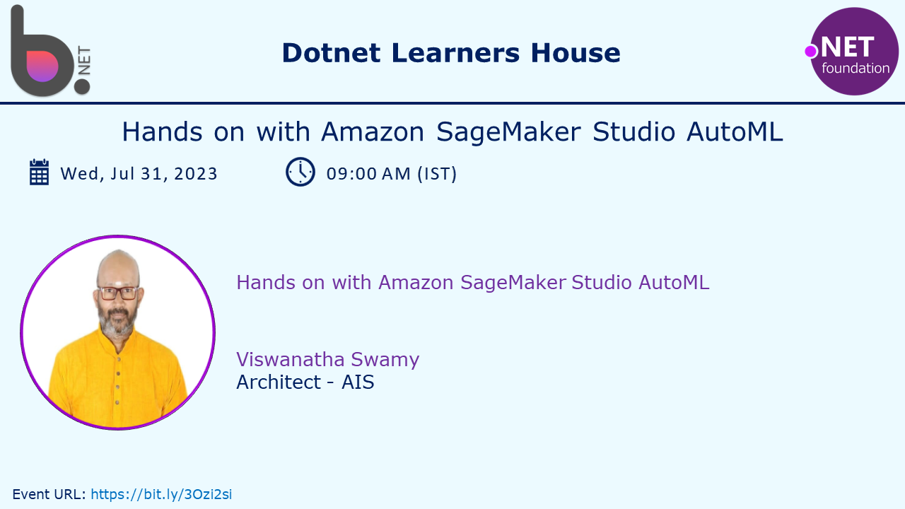

# Amazon SageMaker Studio (AutoML) and SageMaker Canvas - No Code / Low Code

## Date Time: 31-Jul-2023 at 09:00 AM IST

## Event URL: [https://www.meetup.com/dot-net-learners-house-hyderabad/events/293021156](https://www.meetup.com/dot-net-learners-house-hyderabad/events/293021156)

## YouTube URL: [https://www.youtube.com/watch?v=TKkChYB0dM4](https://www.youtube.com/watch?v=TKkChYB0dM4)



---

### Software/Tools

> 1. OS: Windows 10 x64
> 1. .NET 7
> 1. Visual Studio 2022
> 1. Visual Studio Code

### Prior Knowledge

> 1. Basic Programming knowledge
> 1. AWS

## Technology Stack

> 1. .NET 7, AWS

## Information


## What are we doing today?

> 1. 30,000 foot view of options AI/ML on AWS SageMaker
> 1. 30,000 foot view of Amazon SageMaker Studio and Autopilot
> 1. Create a S3 Bucket and Upload the Dataset
> 1. Creating New SageMaker Studio Autopilot Experiment
> 1. SageMaker Studio Autopilot Experiment Runs
> 1. SageMaker Studio Autopilot Generated Notebooks
> 1. Create a Dataset in Amazon SageMaker Canvas
> 1. Create new model
> 1. Build the Model
> 1. Analyze the Model
> 1. Perform Prediction using the Model
> 1. SUMMARY / RECAP / Q&A
> 1. What is next ?

### Please refer to the [**Source Code**](https://github.com/vishipayyallore/speaker-series-2023/tree/main/dotnet-6-on-aws/SageMaker_Studio) of today's session for more details

---


---

## 1. 30,000 foot view of options AI/ML on AWS SageMaker

> 1. Discussion and Demo
> 1. Studio | Studio Lab | Canvas | RStudio | TensorBoard

## 2. 30,000 foot view of Amazon SageMaker Studio and Autopilot

> 1. Discussion and Demo

**Reference(s):**

> 1. [https://docs.aws.amazon.com/sagemaker/latest/dg/autopilot-automate-model-development.html](https://docs.aws.amazon.com/sagemaker/latest/dg/autopilot-automate-model-development.html)


## 3. Create a S3 Bucket and Upload the Dataset

> 1. Discussion and Demo


## 4. Creating New SageMaker Studio Autopilot Experiment

> 1. Discussion and Demo


## 5. SageMaker Studio Autopilot Experiment Runs

> 1. Discussion and Demo


## 6. SageMaker Studio Autopilot Generated Notebooks

> 1. Discussion and Demo


## 7. Create a Dataset in Amazon SageMaker Canvas

> 1. Discussion and Demo
> 1. Browse, import, and join data


## 8. Create new model

> 1. Discussion and Demo


## 9. Build the Model

> 1. Discussion and Demo


## 10. Analyze the Model

> 1. Discussion and Demo


## 11. Perform Prediction using the Model

> 1. Discussion and Demo


---

## SUMMARY / RECAP / Q&A

> 1. SUMMARY / RECAP / Q&A
> 2. Any open queries, I will get back through meetup chat/twitter.

---

## What is Next? session?

> 1. To be decided
> 1. [https://catalog.us-east-1.prod.workshops.aws/workshops/80ba0ea5-7cf9-4b8c-9d3f-1cd988b6c071/en-US/1-use-cases/1-marketing](https://catalog.us-east-1.prod.workshops.aws/workshops/80ba0ea5-7cf9-4b8c-9d3f-1cd988b6c071/en-US/1-use-cases/1-marketing)

```json
{
 "data": {
  "features": {
   "values": {
    "race": "caucasian",
    "gender": "female",
    "age": 21,
    "time_in_hospital": 1,
    "num_lab_procedures": 41,
    "num_procedures": 1,
    "num_medications": 1,
    "number_outpatient": 0,
    "number_emergency": 0,
    "number_inpatient": 0,
    "number_diagnoses": 0,
    "max_glu_serum": "none",
    "a1c_result": "none",
    "change": 0,
    "diabetes_med": 0
   }
  }
 }
}
```
