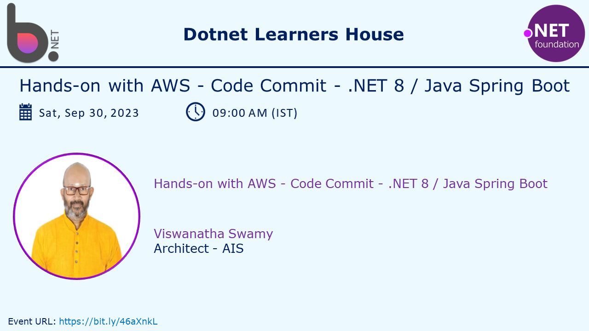
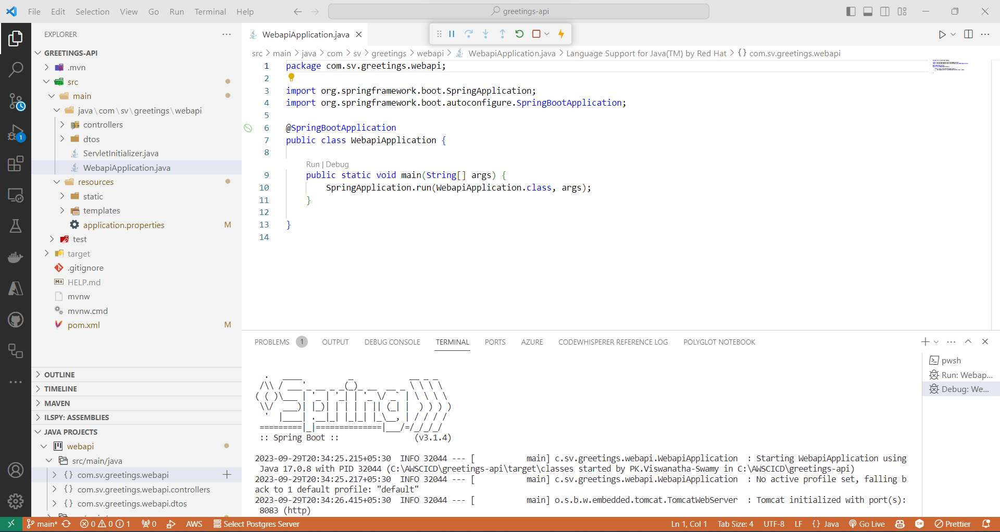

# Hands-on with AWS - Code Commit - .NET 8 / Java Spring Boot

## Date Time: 30-Sep-2023 at 09:00 AM IST

## Event URL: [https://www.meetup.com/dot-net-learners-house-hyderabad/events/295456967](https://www.meetup.com/dot-net-learners-house-hyderabad/events/295456967)

## YouTube URL: [https://www.youtube.com/watch?v=h6l1GoE8qfw](https://www.youtube.com/watch?v=h6l1GoE8qfw)



---

### Software/Tools

> 1. OS: Windows 10 x64
> 1. .NET 8
> 1. Visual Studio 2022
> 1. Visual Studio Code

### Prior Knowledge

> 1. AWS
> 1. Basic Programming knowledge in C#
> 1. Basic Programming knowledge in Java
> 1. Basic Programming knowledge in Java Spring Boot

## Technology Stack

> 1. .NET 8, AWS

## Information


## What are we doing today?

> 1. To be decided
> 1. SUMMARY / RECAP / Q&A
> 1. What is next ?

### Please refer to the [**Source Code**](https://github.com/vishipayyallore/speaker-series-2023/tree/main/dotnet-6-on-aws/20230930_codecommit) of today's session for more details

---


---

## 1. Generate Git Credentials for AWS Code Commit

> 1. Discussion and Demo
> 1. These credentials are required to clone the repositories from AWS Code Commit to local machine


## 2. Create two repositories in AWS Code Commit

> 1. Discussion and Demo
> 1. One repository for Java Spring Boot
> 1. One repository for .NET 8


## 3. Clone the repositories to local machine

> 1. Clone the repositories to local machine
> 1. You **need to use the GIT credentials generated in the previous step** to clone the repositories

```bash
git clone https://git-codecommit.us-west-2.amazonaws.com/v1/repos/shirtsshop-api

git clone https://git-codecommit.us-west-2.amazonaws.com/v1/repos/greetings-api
```


## 4. Creating simple Web Api using Java Spring Boot

> 1. Discussion and Demo
> 1. Navigate to [https://start.spring.io](https://start.spring.io)
> 1. Select the following options shown in the image below and click on **Generate**
> 1. This will download a zip file to your local machine


> 1. Extract the zip file to a folder where the repository is cloned
> 1. Open the folder in Visual Studio Code
> 1. Open the **pom.xml** file and add the following dependency for [lombok](https://projectlombok.org/setup/maven)

```xml
<dependency>
    <groupId>org.projectlombok</groupId>
    <artifactId>lombok</artifactId>
    <version>1.18.30</version>
    <scope>provided</scope>
</dependency>
```

> 1. Update the application.properties file with the following content

```properties
logging.level.org.springframework.web.*=TRACE

server.port=8083
```

> 1. Execute the Application class to start the application



> 1. Periodically push the changes to the repository

```bash
git status
git add .
git commit -am "Message"
git push
```


## 5. Added a greeting controller and DTO

> 1. Discussion and Demo
> 1. Create a `GreetingsResponseDto` DTO, and `GreetingsController` controller


> 1. Execute the Application class to start the application
> 1. Verify the application is running by navigating to [http://localhost:8083/api/v1/greetings](http://localhost:8083/api/v1/greetings)


## 6. View Commit History in AWS Code Commit

> 1. Discussion and Demo


## 7. Create a Branch in AWS Code Commit

> 1. Discussion and Demo


## 8. Create a Pull Request in AWS Code Commit

> 1. Discussion and Demo


## 9. Merge the Pull Request in AWS Code Commit

> 1. Discussion and Demo


---

## SUMMARY / RECAP / Q&A

> 1. SUMMARY / RECAP / Q&A
> 2. Any open queries, I will get back through meetup chat/twitter.

---

## What is Next? session?

> 1. To be decided
> 1. SUMMARY / RECAP / Q&A
> 1. Any open queries, I will get back through meetup chat/twitter.
