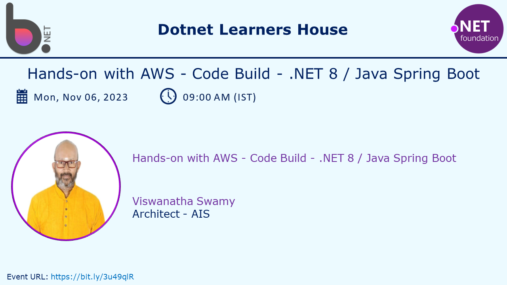
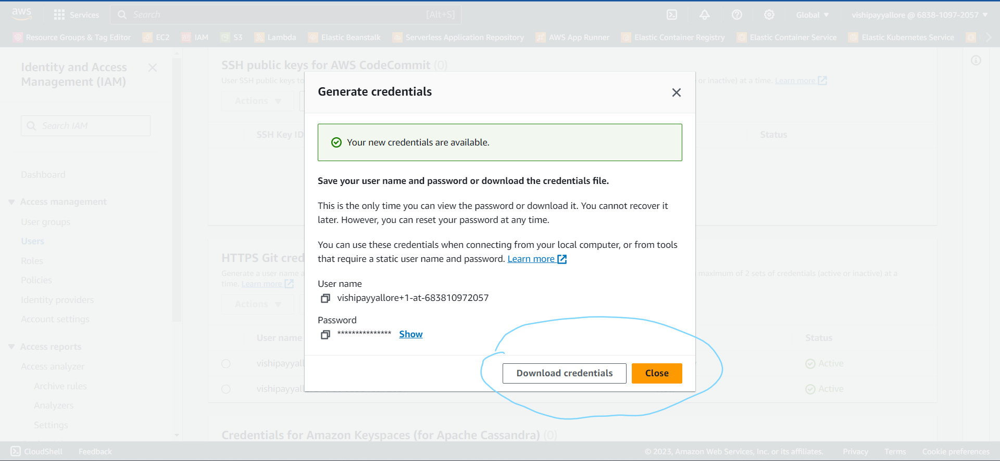

# Hands-on with AWS - Code Build - .NET 8 / Java Spring Boot

## Date Time: 06-Nov-2023 at 09:00 AM IST

## Event URL: [https://www.meetup.com/dot-net-learners-house-hyderabad/events/296075156](https://www.meetup.com/dot-net-learners-house-hyderabad/events/296075156)

## YouTube URL: [https://www.youtube.com/watch?v=h6l1GoE8qfw](https://www.youtube.com/watch?v=h6l1GoE8qfw)

---

### Software/Tools

> 1. OS: Windows 10 x64
> 1. .NET 8
> 1. Visual Studio 2022
> 1. Visual Studio Code

### Prior Knowledge

> 1. AWS
> 1. Basic Programming knowledge in C#
> 1. Basic Programming knowledge in Java
> 1. Basic Programming knowledge in Java Spring Boot

## Technology Stack

> 1. .NET 8, AWS

## Information

## What are we doing today?

> 1. Generate Git Credentials for AWS Code Commit
> 1. Create two repositories in AWS Code Commit
> 1. Clone the repositories to local machine
> 1. Creating simple Web Api using Java Spring Boot
> 1. Added a greeting controller and DTO
> 1. View Commit History in AWS Code Commit
> 1. Create a Branch in AWS Code Commit
> 1. Create a Pull Request in AWS Code Commit
> 1. Merge the Pull Request in AWS Code Commit
> 1. SUMMARY / RECAP / Q&A
> 1. What is next ?

### Please refer to the [**Source Code**](https://github.com/vishipayyallore/speaker-series-2023/tree/main/dotnet-6-on-aws/20230930_codecommit) of today's session for more details

---

---

## 1. Generate Git Credentials for AWS Code Commit

> 1. Discussion and Demo
> 1. These credentials are required to clone the repositories from AWS Code Commit to local machine

---

## SUMMARY / RECAP / Q&A

> 1. SUMMARY / RECAP / Q&A
> 2. Any open queries, I will get back through meetup chat/twitter.

---

## What is Next? session?

> 1. To be decided
> 1. SUMMARY / RECAP / Q&A
> 1. Any open queries, I will get back through meetup chat/twitter.
