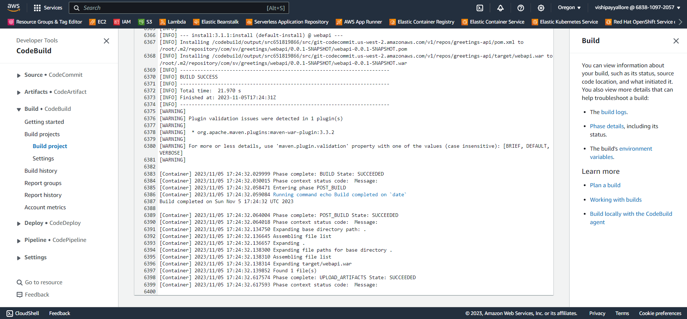

# Hands-on with AWS - Code Build - .NET 8 / Java Spring Boot

## Date Time: 06-Nov-2023 at 09:00 AM IST

## Event URL: [https://www.meetup.com/dot-net-learners-house-hyderabad/events/296075156](https://www.meetup.com/dot-net-learners-house-hyderabad/events/296075156)

## YouTube URL: [https://www.youtube.com/watch?v=hS2CTmgVNK4](https://www.youtube.com/watch?v=hS2CTmgVNK4)


---

### Software/Tools

> 1. OS: Windows 10 x64
> 1. .NET 8
> 1. Visual Studio 2022
> 1. Visual Studio Code

### Prior Knowledge

> 1. AWS
> 1. Basic Programming knowledge in C#
> 1. Basic Programming knowledge in Java
> 1. Basic Programming knowledge in Java Spring Boot

## Technology Stack

> 1. .NET 8, AWS

## Information


## What are we doing today?

> 1. Existing AWS Code Commit Repositories
> 1. What is AWS Code Build?
> 1. Basic Code Build Workflow
> 1. Create the S3 Bucket
> 1. Create the Code Build Project
> 1. Start the Build in AWS Code Build Project
> 1. Clean, Build and Test the Spring Boot and .NET 8 Application Locally
> 1. Few Git Commands
> 1. Create the BuildSpec.yml
> 1. Start the Build
> 1. View the Build Logs
> 1. View the Build History
> 1. SUMMARY / RECAP / Q&A
> 1. What is next ?

### Please refer to the [**Source Code**](https://github.com/vishipayyallore/learn-aws-in-2024) of today's session for more details

---


---

## 1. Existing AWS Code Commit Repositories

> 1. Discussion and Demo


## 2. What is AWS Code Build?

> 1. Discussion
> 1. Code Build is a fully managed continuous integration service that compiles source code, runs tests, and produces software packages that are ready to deploy.
> 1. Code build project, is a collection of build configurations settings that AWS CodeBuild uses when running a build.
> 1. Code build environment, is a representation of operating system, programming language runtime, and tools that AWS CodeBuild uses to run a build.
> 1. Code build buildspec, is a collection of build commands and related settings, in YAML format, that AWS CodeBuild uses to run a build.
> 1. Code build build badge, is a small image that you can include in your websites and documentation to indicate the status of a build.
> 1. Code build build logs, is a record of the events that occurred during a build.
> 1. Code build build history, is a record of the builds that you have run in AWS CodeBuild.
> 1. Code build build artifacts, are the files that are generated when AWS CodeBuild runs a build. You can specify the location where AWS CodeBuild stores these files.


**Reference(s):**

> 1. <https://docs.aws.amazon.com/codebuild/>
> 1. <https://docs.aws.amazon.com/codebuild/latest/userguide/welcome.html>
> 1. <https://docs.aws.amazon.com/codebuild/latest/userguide/concepts.html>
> 1. <https://docs.aws.amazon.com/codebuild/latest/userguide/trigger-create.html>
> 1. <https://docs.aws.amazon.com/codebuild/latest/userguide/build-spec-ref.html>

## 3. Basic Code Build Workflow

> 1. Developer commits the code to AWS Code Commit
> 1. AWS Code Build will build the code
> 1. AWS Code Build will run the tests
> 1. AWS Code Build will publish the artifacts to S3 Bucket

## 4. Create the S3 Bucket

> 1. Discussion and Demo


## 5. Create the Code Build Project

> 1. Discussion and Demo


## 6. Start the Build in AWS Code Build Project

> 1. Discussion and Demo


## 7. Clean, Build and Test the Spring Boot and .NET 8 Application Locally

> 1. Discussion and Demo

```bash
& "c:\GitHub\learn-aws-in-2024\code-for-cicd\greetings-api\mvnw.cmd" clean -f "c:\GitHub\learn-aws-in-2024\code-for-cicd\greetings-api\pom.xml"

& "c:\GitHub\learn-aws-in-2024\code-for-cicd\greetings-api\mvnw.cmd" validate -f "c:\GitHub\learn-aws-in-2024\code-for-cicd\greetings-api\pom.xml"

& "c:\GitHub\learn-aws-in-2024\code-for-cicd\greetings-api\mvnw.cmd" install -f "c:\GitHub\learn-aws-in-2024\code-for-cicd\greetings-api\pom.xml"
```


## 8. Few Git Commands

> 1. Discussion and Demo

```bash
git checkout main
git fetch
git pull

git branch

git checkout swamy/05nov-work
git merge main

git status
git diff

git add .
git commit -m "Added the BuildSpec.yml"
```


## 9. Create the BuildSpec.yml

> 1. Discussion and Demo
> 1. Version | Phases | Artifacts
> 1. Install | Pre Build | Build | Post Build

Reference(s):

> 1. <https://aws.amazon.com/blogs/devops/building-net-7-applications-with-aws-codebuild/>
> 1. <https://docs.aws.amazon.com/codebuild/latest/userguide/getting-started-create-build-spec-console.html>

```yml
version: 0.2

phases:
  install:
    runtime-versions:
      java: corretto17
  pre_build:
    commands:
      - echo Nothing to do in the pre_build phase...
  build:
    commands:
      - echo Build started on `date`
      - mvn install
  post_build:
    commands:
      - echo Build completed on `date`
artifacts:
  files:
    - target/webapi.war
```

## 10. Start the Build

> 1. Discussion and Demo


## 11. View the Build Logs

> 1. Discussion and Demo



## 12. View the Build History

> 1. Discussion and Demo


## 13. View the Build Artifacts

> 1. Discussion and Demo


---

## SUMMARY / RECAP / Q&A

> 1. SUMMARY / RECAP / Q&A
> 2. Any open queries, I will get back through meetup chat/twitter.

---

## What is Next? session?

> 1. To be decided
> 1. SUMMARY / RECAP / Q&A
> 1. Any open queries, I will get back through meetup chat/twitter.
