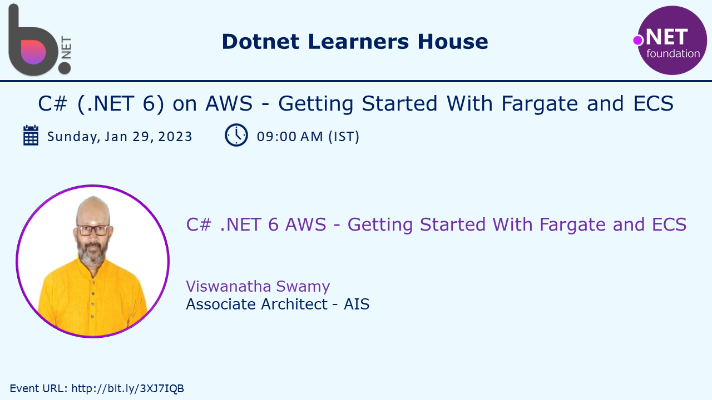
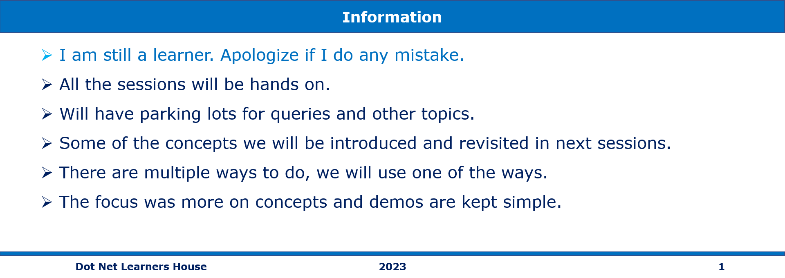

# C# - .NET 6 on AWS - Getting Started With Docker, Fargate and ECS

## Date Time: 29-Jan-2023 at 09:00 AM IST

## Event URL: [https://www.meetup.com/dot-net-learners-house-hyderabad/events/290133360](https://www.meetup.com/dot-net-learners-house-hyderabad/events/290133360)

## YouTube URL: [https://www.youtube.com/watch?v=Ydd8FQvHr3Q](https://www.youtube.com/watch?v=Ydd8FQvHr3Q)

---

### Software/Tools

> 1. OS: Windows 10 x64
> 1. .NET 7
> 1. Visual Studio 2022
> 1. Visual Studio Code

### Prior Knowledge

> 1. Programming knowledge in C#
> 1. Azure
> 1. Angular 15
> 1. .NET Razor/Blazor WASM

## Technology Stack

> 1. .NET 5/6/7, AWS

## Information

## What are we doing today?

> 1. 30,000 foot view of Docker / Just Enough Docker
>    - Docker architecture
>    - The Docker daemon
>    - The Docker client
>    - The Docker Images
>    - The Docker Containers
>    - The Docker Images Registry
> 1. Hands-on with Docker using nginx on Local Machine
> 1. Creating Minimal API using dotnet CLI
>    - `dotnet new list`
>    - Create Minimal API using `dotnet new web`
>    - Create Minimal API using `dotnet new webapi -minimal`
> 1. SUMMARY / RECAP / Q&A
> 1. What is next ?

### Please refer to the [**Source Code**](https://github.com/vishipayyallore/speaker-series-2023/tree/main/dotnet-6-on-aws/Fargate_ECS_S1) of today's session for more details

---

---

## 1. 30,000 foot view of Docker

> 1. Discussion and Demo

**References:**

> 1. [https://docs.docker.com/get-started/overview/](https://docs.docker.com/get-started/overview/)

### Docker architecture

> 1. Discussion and Demo

### The Docker daemon

> 1. Discussion and Demo

### The Docker client

> 1. Discussion and Demo

### The Docker Images

> 1. Discussion and Demo

### The Docker Containers

> 1. Discussion and Demo

### The Docker Images Registry

> 1. Discussion and Demo

## 2. Hands-on with Docker using nginx on Local Machine

> 1. Discussion and Demo

**References:**

> 1. [https://hub.docker.com/_/nginx](https://hub.docker.com/_/nginx)

---

## SUMMARY / RECAP / Q&A

> 1. SUMMARY / RECAP / Q&A
> 2. Any open queries, I will get back through meetup chat/twitter.

---

## What is Next? session?

> 1. Creating our own Docker Image
> 1. Pushing it to Docker Hub
> 1. Working with FarGate and ECS
