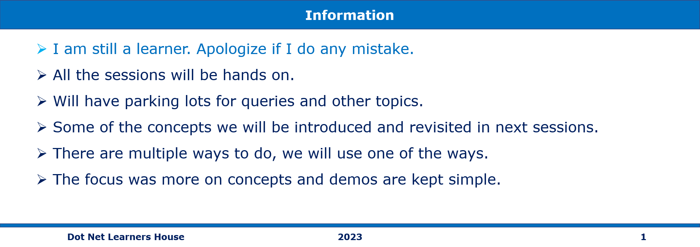
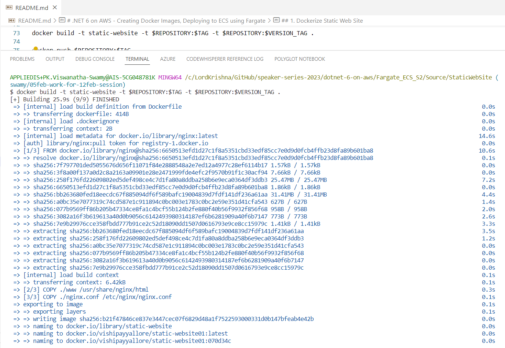

# .NET 6 on AWS - Creating Docker Images, Deploying to ECS using Fargate

## Date Time: 12-Feb-2023 at 09:00 AM IST

## Event URL: [https://www.meetup.com/dot-net-learners-house-hyderabad/events/291262858](https://www.meetup.com/dot-net-learners-house-hyderabad/events/291262858)

## YouTube URL: [https://www.youtube.com/watch?v=2QUHjKsFhYA](https://www.youtube.com/watch?v=2QUHjKsFhYA)


---

### Software/Tools

> 1. OS: Windows 10 x64
> 1. .NET 7
> 1. Visual Studio 2022
> 1. Visual Studio Code

### Prior Knowledge

> 1. Programming knowledge in C#
> 1. Azure
> 1. Angular 15
> 1. .NET Razor/Blazor WASM

## Technology Stack

> 1. .NET 6/7, AWS

## Information



## What are we doing today?

> 1. 30,000 foot view of Docker / Just Enough Docker
>    - Docker architecture
>    - The Docker daemon
>    - The Docker client
>    - The Docker Images
>    - The Docker Containers
>    - The Docker Images Registry
> 1. Hands-on with Docker using `nginx` on Local Machine
> 1. Hands-on with Docker using `Razor Web App` on Local Machine
> 1. 30,000 foot view of ECS / Just Enough ECS
> 1. Hands-on with FarGate/ECD using `nginx` on AWS Console
> 1. Hands-on with FarGate/ECD using `Razor Web App` on AWS Console
> 1. SUMMARY / RECAP / Q&A
> 1. What is next ?

### Please refer to the [**Source Code**](https://github.com/vishipayyallore/speaker-series-2023/tree/main/dotnet-6-on-aws/Fargate_ECS_S1) of today's session for more details

---


---

## 1. Dockerize Static Web Site

> 1. Discussion and Demo

**Reference(s):**

> 1. [https://www.nginx.com/resources/wiki/start/topics/examples/full/](https://www.nginx.com/resources/wiki/start/topics/examples/full/)

### Build and Push the Docker Image to Docker Hub

```dockercmd
TAG=latest
VERSION_TAG=$(git log -1 --pretty=format:%h)
echo "version tag: $VERSION_TAG"

REPOSITORY=vishipayyallore/static-website

docker login

docker build -t $REPOSITORY:$TAG -t $REPOSITORY:$VERSION_TAG .

docker push $REPOSITORY:$TAG
docker push $REPOSITORY:$VERSION_TAG
```



### Execute Docker Image from Docker Hub on Local Machine

```dockercmd
docker run -d --rm --name static-website-10feb -p 8009:80 vishipayyallore/static-website
```


## 2. Hands-on Static Web Site Docker Image with ECS/Fargate on AWS Console

> 1. Discussion and Demo

## 2. Hands-on with Docker using `nginx` on Local Machine

> 1. Discussion and Demo

---

## SUMMARY / RECAP / Q&A

> 1. SUMMARY / RECAP / Q&A
> 2. Any open queries, I will get back through meetup chat/twitter.

---

## What is Next? session?

> 1. Creating our own Docker Image
> 1. Pushing it to Docker Hub
> 1. Working with FarGate and ECS
