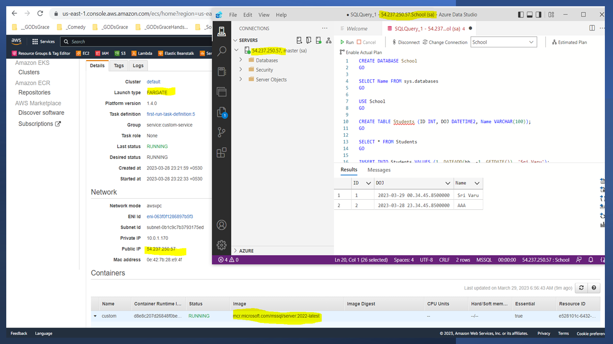

# .NET 7 on AWS - MS SQL Server 2022 on AWS ECS using Fargate

## Date Time: 29-Mar-2023 at 09:00 AM IST

## Event URL: [https://www.meetup.com/dot-net-learners-house-hyderabad/events/291609779/](https://www.meetup.com/dot-net-learners-house-hyderabad/events/291609779/)

## YouTube URL: [https://www.youtube.com/watch?v=a8GdSOASGps](https://www.youtube.com/watch?v=a8GdSOASGps)


---

### Software/Tools

> 1. OS: Windows 10 x64
> 1. .NET 7
> 1. Visual Studio 2022
> 1. Visual Studio Code

### Prior Knowledge

> 1. Programming knowledge in C#
> 1. Azure / AWS
> 1. Angular 15
> 1. .NET Razor/Blazor WASM

## Technology Stack

> 1. .NET 7, AWS

## Information


## What are we doing today?

> 1. Quick Recap of the `previous sessions`
>    - [https://www.youtube.com/watch?v=Ydd8FQvHr3Q](https://www.youtube.com/watch?v=Ydd8FQvHr3Q)
>    - [https://www.youtube.com/watch?v=2QUHjKsFhYA](https://www.youtube.com/watch?v=2QUHjKsFhYA)
> 1. Deploying MS SQL Server on Local Docker
>    - Creating MS SQL Server 2022 Container on Local Docker
>    - Connecting to MS SQL Server 2022 hosted on Local Docker using VS Code
>    - Connecting to MS SQL Server 2022 hosted on Local Docker using Azure Data Studio
>    - Creating Database, Table, and Data on MS SQL Server 2022 using VS Code / Azure Data Studio / sqlcmd
> 1. Deploying MS SQL Server on AWS ECS using Fargate
>    - Create Container, Task Definition, and Service on AWS ECS using AWS Console
>    - Connecting to MS SQL Server 2022 hosted on AWS ECS using Azure Data Studio
>    - Creating Database, Table, and Data on MS SQL Server 2022 using Azure Data Studio
>    - Create Container, Task Definition, and Service on AWS ECS using AWS Console
> 1. SUMMARY / RECAP / Q&A
> 1. What is next ?

### Please refer to the [**Source Code**](https://github.com/vishipayyallore/speaker-series-2023/tree/main/dotnet-6-on-aws/Fargate_ECS_S1) of today's session for more details

---


---

## 1. Quick Recap of the `previous sessions`

> 1. [https://www.youtube.com/watch?v=Ydd8FQvHr3Q](https://www.youtube.com/watch?v=Ydd8FQvHr3Q)
> 1. [https://www.youtube.com/watch?v=2QUHjKsFhYA](https://www.youtube.com/watch?v=2QUHjKsFhYA)

## 2. Deploying MS SQL Server on Local Docker

> 1. Demo and Hands-on

### Creating MS SQL Server 2022 Container on Local Docker

> 1. Demo and Hands-on

```bash
docker image pull mcr.microsoft.com/mssql/server:2022-latest

docker image ls

docker run -d -e "ACCEPT_EULA=1" -e "MSSQL_SA_PASSWORD=Password@123" -p 1433:1433 --name=school-db mcr.microsoft.com/mssql/server:2022-latest

docker exec -it school-db /bin/bash

/opt/mssql-tools/bin/sqlcmd -S localhost -U SA -P Password@123

QUIT
exit
```


### Connecting to MS SQL Server 2022 hosted on Local Docker using VS Code

> 1. Demo and Hands-on

### Connecting to MS SQL Server 2022 hosted on Local Docker using Azure Data Studio

> 1. Demo and Hands-on

### Creating Database, Table, and Data on MS SQL Server 2022 using VS Code / Azure Data Studio / sqlcmd

> 1. Demo and Hands-on

## 3. Deploying MS SQL Server on AWS ECS using Fargate

> 1. Demo and Hands-on

### Create Container, Task Definition, and Service on AWS ECS using AWS Console

> 1. Demo and Hands-on


### Connecting to MS SQL Server 2022 hosted on AWS ECS using Azure Data Studio

> 1. Demo and Hands-on


### Creating Database, Table, and Data on MS SQL Server 2022 using Azure Data Studio

> 1. Demo and Hands-on

```sql
CREATE DATABASE School
GO

SELECT Name FROM sys.databases
GO

USE School
GO

CREATE TABLE Students (ID INT, DOJ DATETIME2, Name VARCHAR(100));
GO

SELECT * FROM Students
GO

INSERT INTO Students VALUES (1, DATEADD(hh, -1, GETDATE()), 'Sri Varu');
INSERT INTO Students VALUES (2, DATEADD(hh, -2, GETDATE()), 'AAA');
GO

SELECT * FROM Students
GO
```


### Accessing MS SQL Server 2022 from AWS ECS



---

## SUMMARY / RECAP / Q&A

> 1. SUMMARY / RECAP / Q&A
> 2. Any open queries, I will get back through meetup chat/twitter.

---

## What is Next? session?

> 1. Deep dive into Dockerfile
> 1. Hands-on with Dockerize Angular 15 Single Page Application
> 1. Pushing it to Docker Hub
> 1. Hands-on with Fargate/ECS using Angular 15 SPA Docker Image on AWS Console
> 1. Working with Multi Container in ECS using Fargate (`Microservices`)
