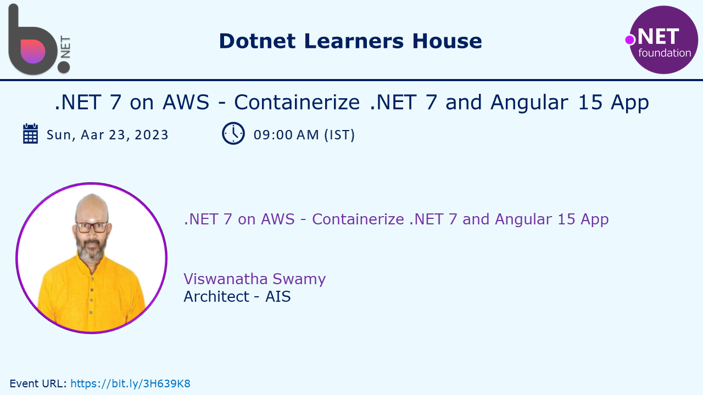
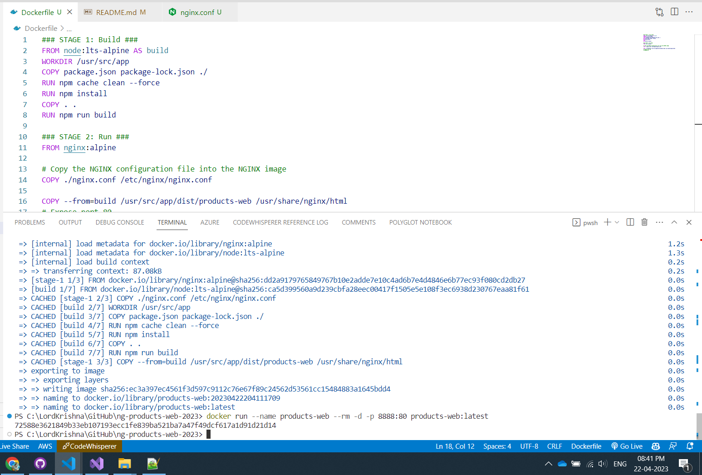
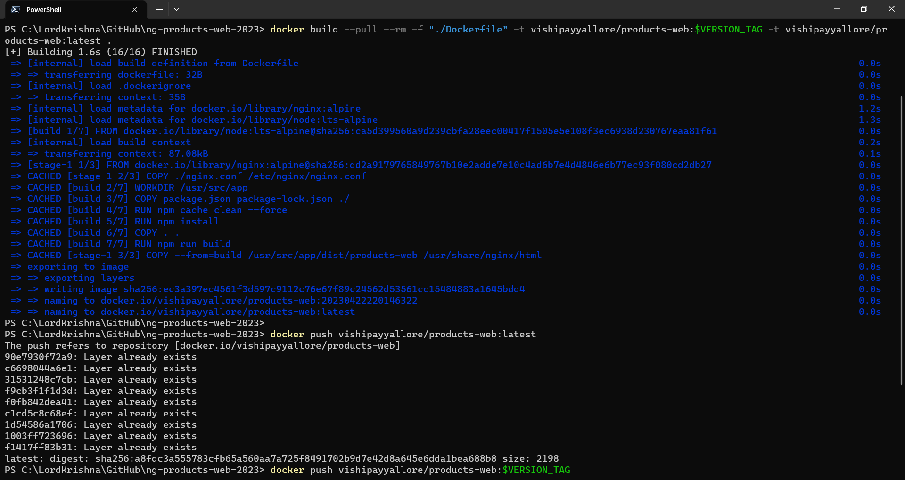
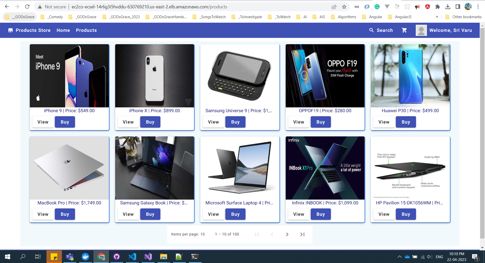

# .NET 7 on AWS - Dockerfile Deep Dive, and Containerize .NET 7 and Angular 15 App

## Date Time: 23-Aar-2023 at 09:00 AM IST

## Event URL: [https://www.meetup.com/dot-net-learners-house-hyderabad/events/292399294](https://www.meetup.com/dot-net-learners-house-hyderabad/events/292399294)

## YouTube URL: [https://www.youtube.com/watch?v=85my3e6IxRU](https://www.youtube.com/watch?v=85my3e6IxRU)



---

### Software/Tools

> 1. OS: Windows 10 x64
> 1. .NET 7
> 1. Visual Studio 2022
> 1. Visual Studio Code

### Prior Knowledge

> 1. Programming knowledge in C#
> 1. Azure / AWS
> 1. Angular 15
> 1. .NET Razor/Blazor WASM

## Technology Stack

> 1. .NET 7, AWS

## Information


## What are we doing today?

> 1. Quick Recap of the `previous sessions`
>    - [https://www.youtube.com/watch?v=Ydd8FQvHr3Q](https://www.youtube.com/watch?v=Ydd8FQvHr3Q)
>    - [https://www.youtube.com/watch?v=2QUHjKsFhYA](https://www.youtube.com/watch?v=2QUHjKsFhYA)
>    - [https://www.youtube.com/watch?v=a8GdSOASGps](https://www.youtube.com/watch?v=a8GdSOASGps)
> 1. Dockerfile Deep Dive
>    - Simple Dockerfile
>    - Multi Stage Dockerfile
> 1. Tools to create Dockerfile
>    - Manual
>    - VS Code Extension
>    - VS 2022
> 1. Dockerizing .NET Web API
> 1. Dockerizing Angular 15 SPA
> 1. Deploying Angular 15 SPA to AWS ECS using Fargate
> 1. SUMMARY / RECAP / Q&A
> 1. What is next ?

### Please refer to the [**Source Code**](https://github.com/vishipayyallore/speaker-series-2023/tree/main/dotnet-6-on-aws/Fargate_ECS_S4) of today's session for more details

---


---

## 1. Quick Recap of the `previous sessions`

> 1. [https://www.youtube.com/watch?v=Ydd8FQvHr3Q](https://www.youtube.com/watch?v=Ydd8FQvHr3Q)
> 1. [https://www.youtube.com/watch?v=2QUHjKsFhYA](https://www.youtube.com/watch?v=2QUHjKsFhYA)
> 1. [https://www.youtube.com/watch?v=a8GdSOASGps](https://www.youtube.com/watch?v=a8GdSOASGps)

**Hint:**

> 1. Volume Mount Path [\\wsl$\docker-desktop-data\data\docker\volumes](\\wsl$\docker-desktop-data\data\docker\volumes)

## 2. Dockerfile Deep Dive

> 1. Demo and Hands-on

### Simple Dockerfile

```dockerfile
# Use an official NGINX image as the base image
FROM nginx

# Copy the static files into the NGINX image
COPY ./www /usr/share/nginx/html

# Copy the NGINX configuration file into the NGINX image
COPY ./nginx.conf /etc/nginx/nginx.conf

# Expose port 80 for incoming traffic
EXPOSE 80

# Start NGINX when the container is run
CMD ["nginx", "-g", "daemon off;"]
```

### Multi Stage Dockerfile

```dockerfile
### STAGE 1: Build ###
FROM node:lts-alpine AS build
WORKDIR /usr/src/app
COPY package.json package-lock.json ./
RUN npm cache clean --force
RUN npm install
COPY . .
RUN npm run build

### STAGE 2: Run ###
FROM nginx:alpine
# Copy the NGINX configuration file into the NGINX image
COPY ./nginx.conf /etc/nginx/nginx.conf
# Expose port 80 for incoming traffic
EXPOSE 80
COPY --from=build /usr/src/app/dist/products-web /usr/share/nginx/html
```

## 3. Tools to create Dockerfile

> 1. Demo and Hands-on

### Manual

> 1. Demo and Hands-on

### VS Code Extension

> 1. Demo and Hands-on

### VS 2022

> 1. Demo and Hands-on

## 4. Dockerizing .NET Web API

> 1. Demo and Hands-on

## 5. Dockerizing Angular 15 SPA

> 1. Demo and Hands-on

```powershell
docker build --pull --rm -f "./Dockerfile" -t products-web:$(Get-Date -Format yyyyMMddHHmmssfff) -t products-web:latest .

docker run --name products-web --rm -d -p 8888:80 products-web:latest
```



```powershell
cd C:\LordKrishna\GitHub\ng-products-web-2023

$VERSION_TAG=$(Get-Date -Format yyyyMMddHHmmssfff)

docker login

docker build --pull --rm -f "./Dockerfile" -t vishipayyallore/products-web:$VERSION_TAG -t vishipayyallore/products-web:latest .

docker push vishipayyallore/products-web:latest
docker push vishipayyallore/products-web:$VERSION_TAG
```



## 6. Deploying Angular 15 SPA to AWS ECS using Fargate

> 1. Demo and Hands-on
> 1. [http://ec2co-ecsel-14r6g3i5hvddu-630769210.us-east-2.elb.amazonaws.com](http://ec2co-ecsel-14r6g3i5hvddu-630769210.us-east-2.elb.amazonaws.com)



---

## SUMMARY / RECAP / Q&A

> 1. SUMMARY / RECAP / Q&A
> 2. Any open queries, I will get back through meetup chat/twitter.

---

## What is Next? session?

> 1. Deep dive into Dockerfile
> 1. Hands-on with Dockerize Angular 15 Single Page Application
> 1. Pushing it to Docker Hub
> 1. Hands-on with Fargate/ECS using Angular 15 SPA Docker Image on AWS Console
> 1. Working with Multi Container in ECS using Fargate (`Microservices`)
