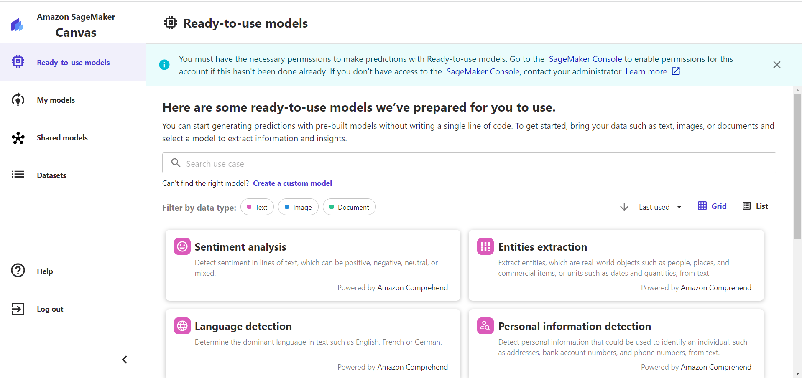

# .NET 7 on AWS - Hands-On - Getting Started with Amazon SageMaker Canvas

## Date Time: 31-May-2023 at 09:00 AM IST

## Event URL: [https://www.meetup.com/dot-net-learners-house-hyderabad/events/293021132](https://www.meetup.com/dot-net-learners-house-hyderabad/events/293021132)

## YouTube URL: [https://www.youtube.com/watch?v=TKkChYB0dM4](https://www.youtube.com/watch?v=TKkChYB0dM4)

---

### Software/Tools

> 1. OS: Windows 10 x64
> 1. .NET 7
> 1. Visual Studio 2022
> 1. Visual Studio Code

### Prior Knowledge

> 1. Basic Programming knowledge
> 1. AWS

## Technology Stack

> 1. .NET 7, AWS

## Information

## What are we doing today?

> 1. 30,000 foot view of Data Science, Machine Learning, Artificial Intelligence, and AutoML
> 1. 30,000 foot view of Amazon SageMaker
> 1. 30,000 foot view of Amazon SageMaker Canvas
> 1. Creating Domains in Amazon SageMaker
> 1. Launch Amazon SageMaker Canvas
> 1. Create a S3 Bucket and Upload the Dataset
> 1. Create a Dataset in Amazon SageMaker Canvas
> 1. Create new model
> 1. Build the Model
> 1. Analyze the Model
> 1. Perform Prediction using the Model
> 1. SUMMARY / RECAP / Q&A
> 1. What is next ?

### Please refer to the [**Source Code**](https://github.com/vishipayyallore/speaker-series-2023/tree/main/dotnet-6-on-aws/SageMaker_Canvas_S1) of today's session for more details

---

---

## 1. 30,000 foot view of Data Science, Machine Learning, Artificial Intelligence, and AutoML

> 1. Single Liner on Data Science
> 1. Single Liner on Machine Learning
> 1. Single Liner on Artificial Intelligence
> 1. Single Liner on AutoML

**Reference(s):**

> 1. [https://aws.amazon.com/machine-learning/what-is-ai/](https://aws.amazon.com/machine-learning/what-is-ai/)
> 1. [https://aws.amazon.com/what-is/machine-learning/](https://aws.amazon.com/what-is/machine-learning/)
> 1. [https://aws.amazon.com/what-is/data-science/](https://aws.amazon.com/what-is/data-science/)
> 1. [https://bigcloud.global/a-beginners-guide-to-data-science-ai-and-ml/](https://bigcloud.global/a-beginners-guide-to-data-science-ai-and-ml/)
> 1. [https://cloud.google.com/learn/artificial-intelligence-vs-machine-learning#:~:text=Differences%20between%20AI%20and%20ML,-Now%20that%20you&text=While%20artificial%20intelligence%20encompasses%20the,accurate%20results%20by%20identifying%20patterns.](https://cloud.google.com/learn/artificial-intelligence-vs-machine-learning#:~:text=Differences%20between%20AI%20and%20ML,-Now%20that%20you&text=While%20artificial%20intelligence%20encompasses%20the,accurate%20results%20by%20identifying%20patterns.)
> 1. [https://www.geeksforgeeks.org/what-is-automl-in-machine-learning/](https://www.geeksforgeeks.org/what-is-automl-in-machine-learning/)

## 2. 30,000 foot view of Amazon SageMaker

> 1. Single Liner on Amazon SageMaker

**Reference(s):**

> 1. [https://aws.amazon.com/sagemaker/](https://aws.amazon.com/sagemaker/)

## 3. 30,000 foot view of Amazon SageMaker Canvas

> 1. Single Liner on Amazon SageMaker Canvas

**Reference(s):**

> 1. [https://aws.amazon.com/sagemaker/canvas](https://aws.amazon.com/sagemaker/canvas)

## 4. Creating Domains in Amazon SageMaker

> 1. Discussion and Demo

## 5. Launch Amazon SageMaker Canvas

> 1. Discussion and Demo

## 6. Create a S3 Bucket and Upload the Dataset

> 1. Discussion and Demo

## 7. Create a Dataset in Amazon SageMaker Canvas

> 1. Discussion and Demo
> 1. Browse, import, and join data

## 8. Create new model

> 1. Discussion and Demo

## 9. Build the Model

> 1. Discussion and Demo

## 10. Analyze the Model

> 1. Discussion and Demo

## 11. Perform Prediction using the Model

> 1. Discussion and Demo

---

## SUMMARY / RECAP / Q&A

> 1. SUMMARY / RECAP / Q&A
> 2. Any open queries, I will get back through meetup chat/twitter.

---

## What is Next? session?

> 1. To be decided
