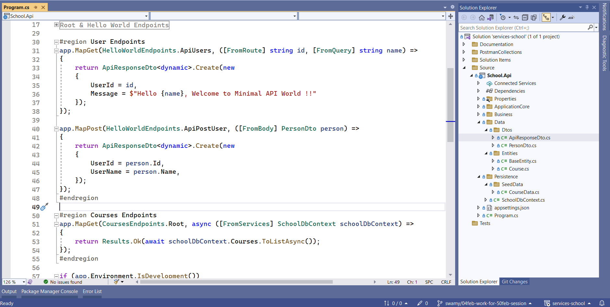

# .NET 7 - Minimal API with Model Binding, Entity, DI, EF Core, and Seed Data

## Date Time: 05-Feb-2023 at 09:00 AM IST

## Event URL: [https://www.meetup.com/dot-net-learners-house-hyderabad/events/290692815](https://www.meetup.com/dot-net-learners-house-hyderabad/events/290692815)

## YouTube URL: [https://www.youtube.com/watch?v=GxIuDp0d1uE](https://www.youtube.com/watch?v=GxIuDp0d1uE)


---

### Software/Tools

> 1. OS: Windows 10 x64
> 1. .NET 7
> 1. Visual Studio 2022
> 1. Visual Studio Code

### Prior Knowledge

> 1. Programming knowledge in C#
> 1. Azure
> 1. Angular 15
> 1. .NET Razor/Blazor WASM

## Technology Stack

> 1. .NET 7, Azure

## Information


## What are we doing today?

> 1. Tour of .NET 7 Minimal API Project (Web API, and Web App Empty Template)
> 1. Dependency Injection, and Comparision of Services
>    - Web App Empty
>    - Web API with Uncheck Controllers
>    - Web API with Controllers
> 1. Comparison of Services Container & HTTP Request Pipeline
> 1. Parameter Binding
>    - From Query | From Route | From Body | From Services
> 1. Base Entity
> 1. Course Entity inheriting Base Entity
> 1. Just enough `Entity Framework` Core (In Memory)
> 1. Dependency Injection of DbContext
> 1. GetAllCourses() API Endpoint
> 1. Seed Data
> 1. Update Postman Collections to test the API (Environment Variables, and Collections)

### Please refer to the [**Source Code**](https://github.com/Microservices-for-Small-School-App/services-school) of today's session for more details

---


---

## 1. Tour of .NET 7 Minimal API Project (Web API, and Web App Empty Template)

> 1. Discussion and Demo

## 2. Dependency Injection

> 1. Discussion and Demo

### Web App Empty |  Web API with Uncheck Controllers |  Web API with Controllers

> 1. Discussion and Demo

## 3. Comparision on Services Container & Http Request Pipeline

> 1. Discussion and Demo

**References:**

> 1. [https://learn.microsoft.com/en-us/aspnet/core/fundamentals/middleware/?view=aspnetcore-7.0](https://learn.microsoft.com/en-us/aspnet/core/fundamentals/middleware/?view=aspnetcore-7.0)
> 1. [https://learn.microsoft.com/en-us/aspnet/core/fundamentals/middleware/write?view=aspnetcore-7.0](https://learn.microsoft.com/en-us/aspnet/core/fundamentals/middleware/write?view=aspnetcore-7.0)

## 4. Parameter Binding

> 1. Discussion and Demo

**References:**

> 1. [https://learn.microsoft.com/en-us/aspnet/core/fundamentals/minimal-apis/parameter-binding?view=aspnetcore-7.0](https://learn.microsoft.com/en-us/aspnet/core/fundamentals/minimal-apis/parameter-binding?view=aspnetcore-7.0)

### From Query | From Route | From Body | From Services

> 1. Discussion and Demo



## 5. Base Entity

> 1. Discussion and Demo

```csharp
public class BaseEntity
{
    [Key]
    public Guid Id { get; set; }

    [Required]
    public DateTime CreatedDate { get; set; }
    
    [Required]
    public string? CreatedBy { get; set; }
    
    [Required]
    public DateTime ModifiedDate { get; set; }
    
    [Required]
    public string? ModifiedBy { get; set; }
}
```

## 6. Course Entity inheriting Base Entity

> 1. Discussion and Demo

```csharp
public class Course : BaseEntity
{
    public string? CourseId { get; set; }

    public string? Name { get; set; }
    
    public int Duration { get; set; }
    
    public string? Description { get; set; }
}
```

## 7. Just enough `Entity Framework` Core (In Memory)

> 1. Discussion and Demo

```xml
<ItemGroup>
    <PackageReference Include="Microsoft.EntityFrameworkCore" Version="7.0.2" />
    <PackageReference Include="Microsoft.EntityFrameworkCore.InMemory" Version="7.0.2" />
</ItemGroup>
```

## 8. Dependency Injection of DbContext

> 1. Discussion and Demo

```csharp
_ = builder.Services.AddDbContext<SchoolDbContext>(options =>
                options.UseInMemoryDatabase(InMemoryDatabase.Name));
```

## 10. GetAllCourses() API Endpoint

> 1. Discussion and Demo


## 10. Seed Data

> 1. Discussion and Demo

## 11. Update Postman Collections to test the API (Environment Variables, and Collections)

> 1. Discussion and Demo


---

## SUMMARY / RECAP / Q&A

> 1. SUMMARY / RECAP / Q&A
> 2. Any open queries, I will get back through meetup chat/twitter.

---

## What is Next? session `3` of `9` Sessions on 19 Feb, 2023

> 1. Enhancing GetAllCourses() API Endpoint to return Unified Response
> 1. Move the Hello World Endpoints into an Extension Class
> 1. Move the User Endpoints into an Extension Class
> 1. Move the Course Endpoints into an Extension Class
> 1. Dtos using record, and returning Dtos
> 1. Auto Mapper Configuration
> 1. Dependency Injection of Auto Mapper
> 1. Enhancing GetAllCourses() API Endpoint to return Dtos
> 1. Update Postman Collections to test the API (Environment Variables, and Collections)
