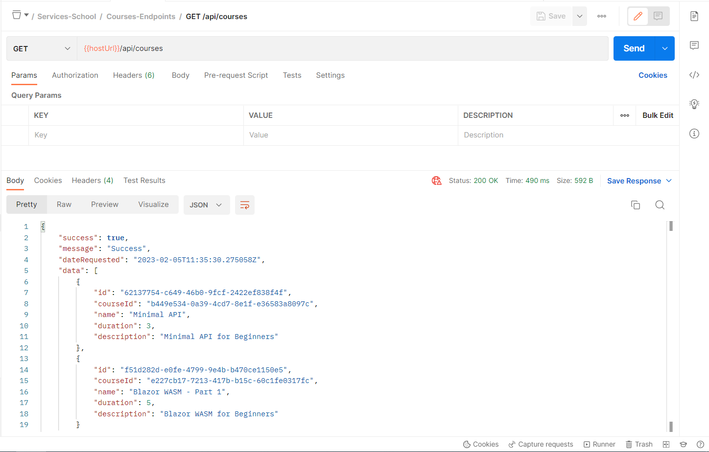

# .NET 7 Minimal API DI, IOC, record, DTOs, AutoMapper, and Extension Methods

## Date Time: 19-Feb-2023 at 09:00 AM IST

## Event URL: [https://www.meetup.com/dot-net-learners-house-hyderabad/events/291087797](https://www.meetup.com/dot-net-learners-house-hyderabad/events/291087797)

## YouTube URL: [https://www.youtube.com/watch?v=ke1OmtK1qU0](https://www.youtube.com/watch?v=ke1OmtK1qU0)


---

### Software/Tools

> 1. OS: Windows 10 x64
> 1. .NET 7
> 1. Visual Studio 2022
> 1. Visual Studio Code

### Prior Knowledge

> 1. Programming knowledge in C#
> 1. Azure
> 1. Angular 15
> 1. .NET Razor/Blazor WASM

## Technology Stack

> 1. .NET 7, Azure

## Information


## What are we doing today?

> 1. Create responses in Minimal API
> 1. Dependency Injection and Inversion of Control - Deep Dive
> 1. Enhancing GetAllCourses() API Endpoint to return Unified Response
> 1. Move the Hello World Endpoints into an Extension Class
> 1. Move the User Endpoints into an Extension Class
> 1. Move the Course Endpoints into an Extension Class
> 1. Creating Course Dtos using record
> 1. Auto Mapper Configuration
> 1. Dependency Injection of Auto Mapper
> 1. Enhancing GetAllCourses() API Endpoint to return Course Dtos
> 1. Update Postman Collections to test the API (Environment Variables, and Collections)

### Please refer to the [**Source Code**](https://github.com/Microservices-for-Small-School-App/services-school) of today's session for more details

---


---

## 1. Create responses in Minimal API

> 1. Discussion and Demo

**References:**

> 1. [https://learn.microsoft.com/en-us/aspnet/core/fundamentals/minimal-apis/responses?view=aspnetcore-7.0](https://learn.microsoft.com/en-us/aspnet/core/fundamentals/minimal-apis/responses?view=aspnetcore-7.0)

## 2. Dependency Injection and Inversion of Control - Deep Dive

> 1. Discussion and Demo

**References:**

> 1. [https://en.wikipedia.org/wiki/Dependency_injection](https://en.wikipedia.org/wiki/Dependency_injection)
> 1. [https://en.wikipedia.org/wiki/Inversion_of_control](https://en.wikipedia.org/wiki/Inversion_of_control)
> 1. [https://dotnettutorials.net/lesson/introduction-to-inversion-of-control](https://dotnettutorials.net/lesson/introduction-to-inversion-of-control)
> 1. [https://alexalvess.medium.com/dependency-injection-and-inversion-of-control-on-net-core-3136fe98b72](https://alexalvess.medium.com/dependency-injection-and-inversion-of-control-on-net-core-3136fe98b72)

```csharp
public static class ServiceCollectionExtensions
{
    public static IServiceCollection ConfigureServices(this IServiceCollection services)
    {
        _ = services.AddTransient<IFooter, Footer>();
        _ = services.AddTransient<IHeader, Header>();

        _ = services.AddTransient<IGenerateNames, GenerateNames>();

        _ = services.AddTransient<INamesArray, NamesArray>();
        _ = services.AddTransient<IPrintHelper, PrintHelper>();

        // IMPORTANT! Register the application entry point
        _ = services.AddTransient<NamesArrayApp>();

        return services;
    }
}
```

## 4. Enhancing GetAllCourses() API Endpoint to return Unified Response

> 1. Discussion and Demo

```csharp
app.MapGet(CoursesRoutes.Root, async ([FromServices] SchoolDbContext schoolDbContext) =>
{
    var coursesResponse = ApiResponseDto<IEnumerable<Course>>.Create(
            await schoolDbContext.Courses.ToListAsync());
    
    return Results.Ok(coursesResponse);
});
```


## 5. Move the Hello World Endpoints into an Extension Class

> 1. Discussion and Demo

**Reference(s):**

> 1. [https://learn.microsoft.com/en-us/aspnet/core/fundamentals/minimal-apis/route-handlers?view=aspnetcore-7.0](https://learn.microsoft.com/en-us/aspnet/core/fundamentals/minimal-apis/route-handlers?view=aspnetcore-7.0)

## 6. Move the User Endpoints into an Extension Class

> 1. Discussion and Demo

## 7. Move the Course Endpoints into an Extension Class

> 1. Discussion and Demo

## 8. Creating Course Dtos using record

> 1. Discussion and Demo

```csharp
public class CourseDto : CreateCourseDto
{
    public Guid Id { get; set; }
}
```

## 9. Auto Mapper Configuration

> 1. Discussion and Demo

```csharp
public class AutoMapperConfig : Profile
{
    public AutoMapperConfig()
    {
        _ = CreateMap<Course, CourseDto>().ReverseMap();
        _ = CreateMap<Course, CreateCourseDto>().ReverseMap();
    }
}
```

## 10. Dependency Injection of Auto Mapper

> 1. Discussion and Demo

```csharp
_ = builder.Services.AddAutoMapper(typeof(AutoMapperConfig));
```

## 9. Enhancing GetAllCourses() API Endpoint to return Dtos

> 1. Discussion and Demo

```csharp
_ = group.MapGet(CoursesRoutes.Root, async ([FromServices] SchoolDbContext schoolDbContext, IMapper mapper) =>
{
    var coursesResponse = ApiResponseDto<IEnumerable<CourseDto>>.Create(
            mapper.Map<IEnumerable<CourseDto>>(await schoolDbContext.Courses.ToListAsync())
        );
    return Results.Ok(coursesResponse);
});
```



## 10. Update Postman Collections to test the API (Environment Variables, and Collections)

> 1. Discussion and Demo


---

## SUMMARY / RECAP / Q&A

> 1. SUMMARY / RECAP / Q&A
> 2. Any open queries, I will get back through meetup chat/twitter.

---

## What is Next? session `4` of `9` Sessions on XX Mar, 2023

> 1. Adding Swagger Dependencies
> 1. WithTags().WithName().Produces(200).ProducesProblem(500);
> 1. Creating Repository Layer
> 1. Creating Business Layer
> 1. Dependency Injection of Swagger, Repository Layer, Business Layer
> 1. Move Service Dependencies into a Extension Class
> 1. Move Http Request Pipeline Dependencies into a Extension Class
> 1. Update Postman Collections to test the API (Environment Variables, and Collections)
> 1. GitHub Actions to build API
