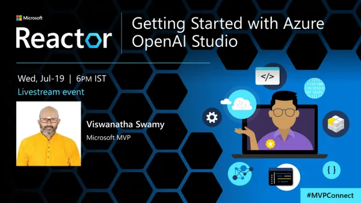
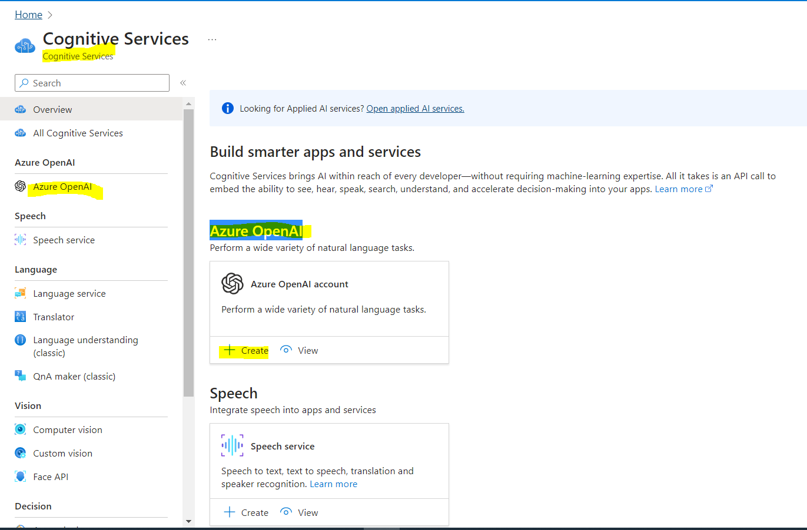
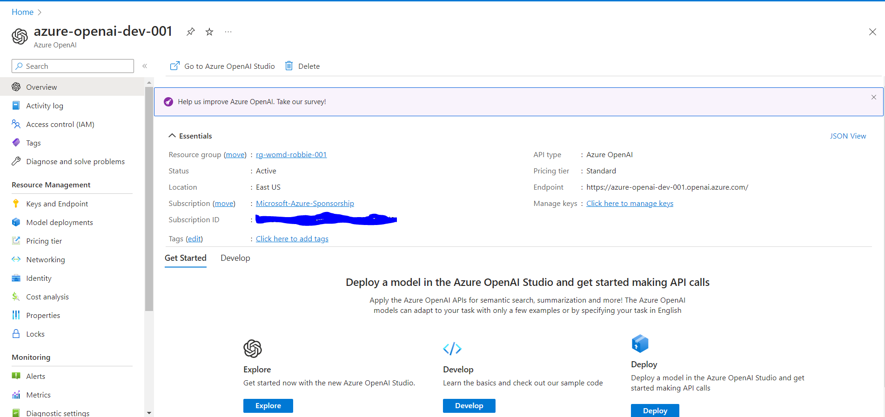
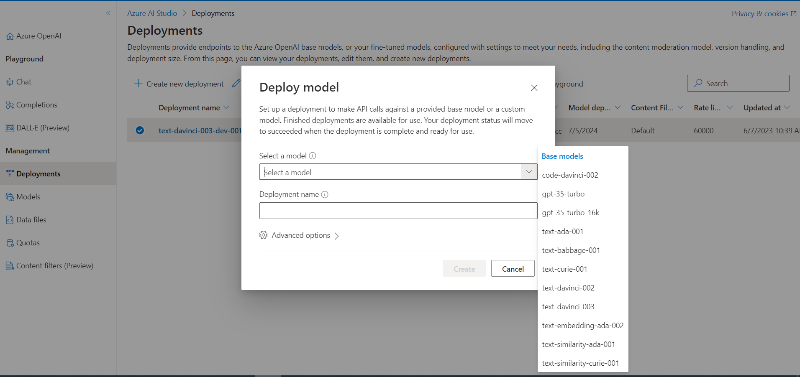
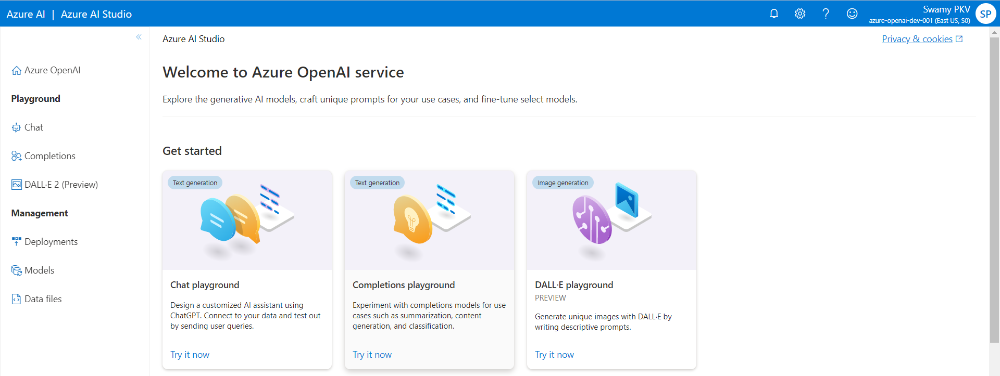
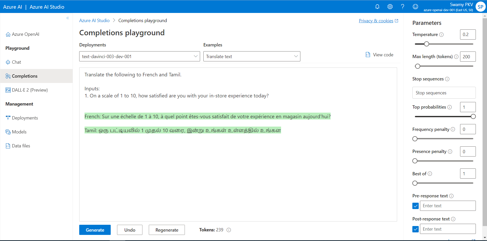
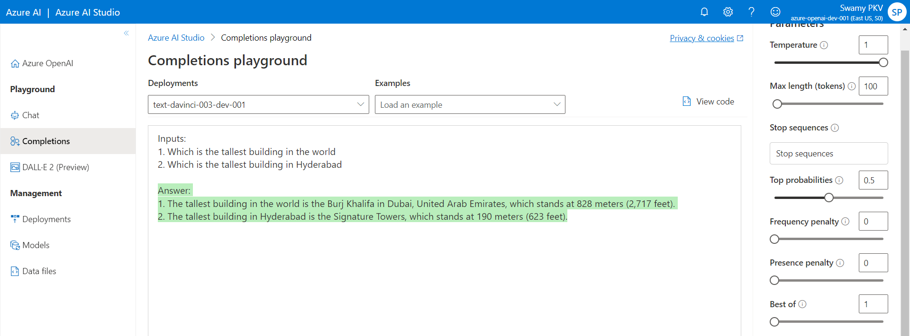
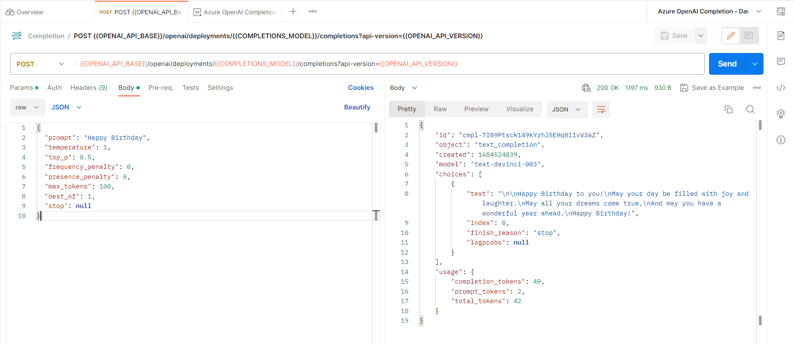

# Hands-On - Getting Started with Azure OpenAI Studio

## Date Time: 19-Jul-2023 at 06:00 PM IST

## Event URL: [https://www.meetup.com/microsoft-reactor-bengaluru/events/294658190](https://www.meetup.com/microsoft-reactor-bengaluru/events/294658190)

## YouTube URL: [https://www.youtube.com/watch?v=WXyxnbxbcsQ](https://www.youtube.com/watch?v=WXyxnbxbcsQ)



---

### Software/Tools

> 1. OS: Windows 10 x64
> 1. Python / .NET 7
> 1. Visual Studio 2022
> 1. Visual Studio Code

### Prior Knowledge

> 1. Programming knowledge in C# / Python
> 1. Azure

## Technology Stack

> 1. .NET 7, Azure, OpenAI

## Information


## What are we doing today?

> 1. 30,000 foot view of Azure OpenAI
>    - What is Azure OpenAI Service?
>    - Azure OpenAI Service quotas and limits
>    - Azure OpenAI Service models
> 1. Create Azure OpenAI Service in Azure Portal
> 1. How to deploy Azure OpenAI Model in Azure AI Studio?
> 1. 30,000 foot view of Azure AI Studio
>    - What is Azure AI Studio?
>    - Trying couple of Built-in Completion Examples in Azure AI Studio
> 1. Tokens Tokens Tokens and more Tokens
> 1. Trying our own Completion Examples in Azure AI Studio
> 1. Trying our own Completion Examples using Postman
> 1. SUMMARY / RECAP / Q&A
> 1. What is next ?

### Please refer to the [**Source Code**](https://github.com/vishipayyallore/speaker-series-2023/tree/main/AzureOpenAI) of today's session for more details

---


---

## 1. 30,000 foot view of Azure OpenAI

> 1. Discussion and Demo

**References:**

> 1. [https://learn.microsoft.com/en-us/azure/cognitive-services/openai/overview](https://learn.microsoft.com/en-us/azure/cognitive-services/openai/overview)
> 1. [https://learn.microsoft.com/en-us/azure/cognitive-services/openai/quotas-limits](https://learn.microsoft.com/en-us/azure/cognitive-services/openai/quotas-limits)
> 1. [https://learn.microsoft.com/en-us/azure/cognitive-services/openai/concepts/models](https://learn.microsoft.com/en-us/azure/cognitive-services/openai/concepts/models)

### 1.1. What is Azure OpenAI Service?

> 1. Discussion and Demo

### 1.2. Azure OpenAI Service quotas and limits

> 1. Discussion and Demo

### 1.3. Azure OpenAI Service models

> 1. Discussion and Demo

## 2. Create Azure OpenAI Service in Azure Portal

> 1. Discussion and Demo





## 3. How to deploy Azure OpenAI Model in Azure AI Studio?

> 1. Discussion and Demo



## 4. 30,000 foot view of Azure AI Studio

> 1. Discussion and Demo

**References:**

> 1. [https://learn.microsoft.com/en-us/azure/cognitive-services/openai/quickstart?pivots=programming-language-studio&tabs=command-line](https://learn.microsoft.com/en-us/azure/cognitive-services/openai/quickstart?pivots=programming-language-studio&tabs=command-line)

### 4.1. What is Azure AI Studio?

> 1. Discussion and Demo



### 4.2. Trying a couple of Built-in Completion Examples in Azure AI Studio

> 1. Discussion and Demo



## 5. Tokens Tokens Tokens and more Tokens

> 1. Discussion and Demo

**References:**

> 1. [https://platform.openai.com/tokenizer](https://platform.openai.com/tokenizer)


## 6. Trying our own Completion Examples in Azure AI Studio

> 1. Discussion and Demo

```text
Input: Happy Birthday

Input: Give the top 5 food items from South India

Input: Give the top 5 Populated states in India

Inputs: 
1. Which is the tallest building in the world 
2. Which is the tallest building in Hyderabad

Input: Tell me two jokes on simple people
```



## 7. Trying our own Completion Examples using Postman

> 1. Discussion and Demo



---

## 8. SUMMARY / RECAP / Q&A

> 1. SUMMARY / RECAP / Q&A
> 2. Any open queries, I will get back through meetup chat/twitter.

---

## What is Next? session?

> 1. Trying our own Completion Examples using Postman
> 1. Trying our own Completion Examples using Python Notebook
> 1. Trying our own Completion Examples using Python
> 1. Trying our own Completion Examples using C# .NET 7
> 1. SUMMARY / RECAP / Q&A
