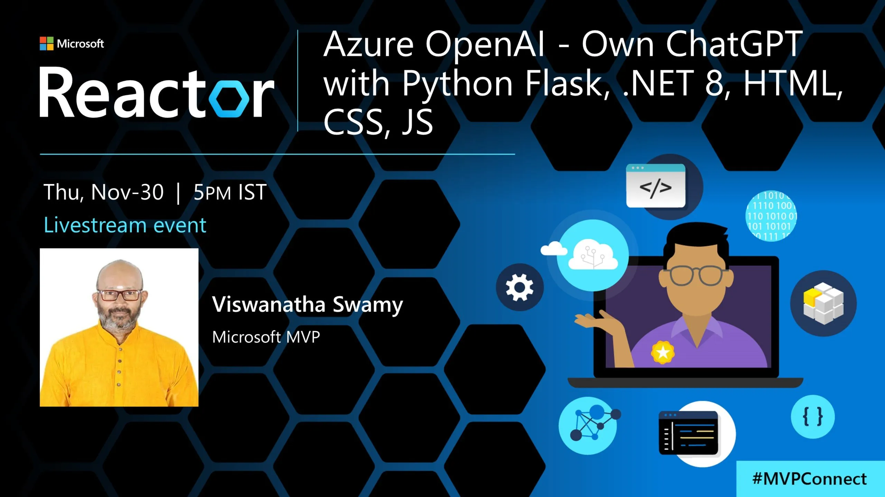
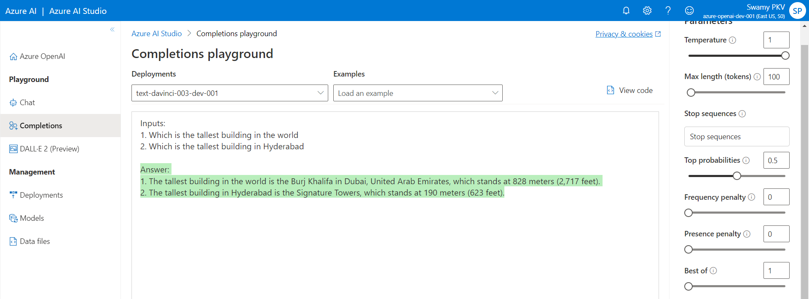

# Hands-On - Own ChatGPT with .NET 8, Python Flask, HTML, CSS, JavaScript

## Date Time: 29-Nov-2023 at 05:00 PM IST

## Event URL: [https://www.meetup.com/microsoft-reactor-bengaluru/events/297192089](https://www.meetup.com/microsoft-reactor-bengaluru/events/297192089)

## YouTube URL: [https://www.youtube.com/watch?v=Tobedone](https://www.youtube.com/watch?v=Tobedone)



---

### Software/Tools

> 1. OS: Windows 10 x64
> 1. Python / .NET 7
> 1. Visual Studio 2022
> 1. Visual Studio Code

### Prior Knowledge

> 1. Programming knowledge in C# / Python
> 1. Azure

## Technology Stack

> 1. .NET 8, Azure, OpenAI, Python Flask, HTML, CSS, JavaScript

## Information


## What are we doing today?

> 1. What is Intelligence?
> 1. Few Terms AI, ML, Auto ML, DL, NLP, GAI
> 1. ELIZA - The early Natural Language Processing (NLP) Chatbot
> 1. Azure Open AI, Transformer, and GPT
> 1. Tokens Tokens Tokens and more Tokens
> 1. Trying our own Completion Examples in Azure AI Studio
> 1. Completion Request using C# .NET 8
> 1. Few .NET and .NET 8 Features
> 1. Create a .env file and update the Environment Variables
> 1. Our Own ChatGPT with .NET 8, Azure Open AI, HTML, CSS, and JS
> 1. Our Own ChatGPT with Python Flask, Azure Open AI, HTML, CSS, and JS
> 1. SUMMARY / RECAP / Q&A
> 1. What is next ?

### Please refer to the [**Source Code**](https://github.com/ViswanathaSwamy-PK-TechSkillz-Academy/learn-azure-openai/tree/main) of today's session for more details

---


---

## 1. What is Intelligence?

> 1. Discussion

## 2. Few Terms AI, ML, Auto ML, DL, NLP, GAI

> 1. Discussion

## 3. ELIZA - The early Natural Language Processing (NLP) Chatbot

> 1. Discussion

## 4. Azure Open AI, Transformer, and GPT

> 1. Discussion

## 5. Tokens Tokens Tokens and more Tokens

> 1. Discussion and Demo

## [**Section 1 to 5 Documentation**](https://github.com/ViswanathaSwamy-PK-TechSkillz-Academy/learn-azure-openai/blob/main/documentation/S2.md)

## 6. Trying our own Completion Examples in Azure AI Studio

> 1. Discussion and Demo

```text
Input: Happy Birthday

Input: Give the top 5 food items from South India

Input: Give the top 5 Populated states in India

Inputs: 
1. Which is the tallest building in the world 
2. Which is the tallest building in Hyderabad

Input: Tell me two jokes on simple people
```



## [**Section 6 Documentation**](https://github.com/vishipayyallore/speaker-series-2023/blob/main/AzureOpenAI/2023Jul05_Prompt_Engineering_Part1/README.md)

## 7. Completion Request using C# .NET 8

> 1. Discussion and Demo

## [**Section 7 Documentation**](https://github.com/ViswanathaSwamy-PK-TechSkillz-Academy/learn-azure-openai/blob/main/documentation/S2.md)

## 8. Few .NET and .NET 8 Features

> 1. JIT Compilation [Source Code (.cs, and .vb) -> Roslyn Compiler -> Intermediate Language -> JIT Compiler -> Machine Code]
> 1. Dependency Injection
> 1. Http Request pipeline
> 1. Implicit usings and Global using
> 1. File Scoped Namespaces
> 1. ShortCircuiting
> 1. Debugging Improvements
> 1. .http files

## 9. Create a appsettings.json / .env file and update the Environment Variables

> 1. Discussion and Demo

## 10. Our Own ChatGPT with .NET 8, Azure Open AI, HTML, CSS, and JavaScript

> 1. Discussion and Demo

## [**Section 8, and 9 Documentation**](https://github.com/vishipayyallore/speaker-series-2023/blob/main/On.NETLiveShows/20231030_BuildYourOwnChatGPT/README.md)

## 1. Our Own ChatGPT with Python Flask, Azure Open AI, HTML, CSS, and JavaScript - **`Stretch Goal`**

> 1. Discussion and Demo

---

## X. SUMMARY / RECAP / Q&A

> 1. SUMMARY / RECAP / Q&A
> 2. Any open queries, I will get back through meetup chat/twitter.

---

## What is Next? session?

> 1. Discussion
