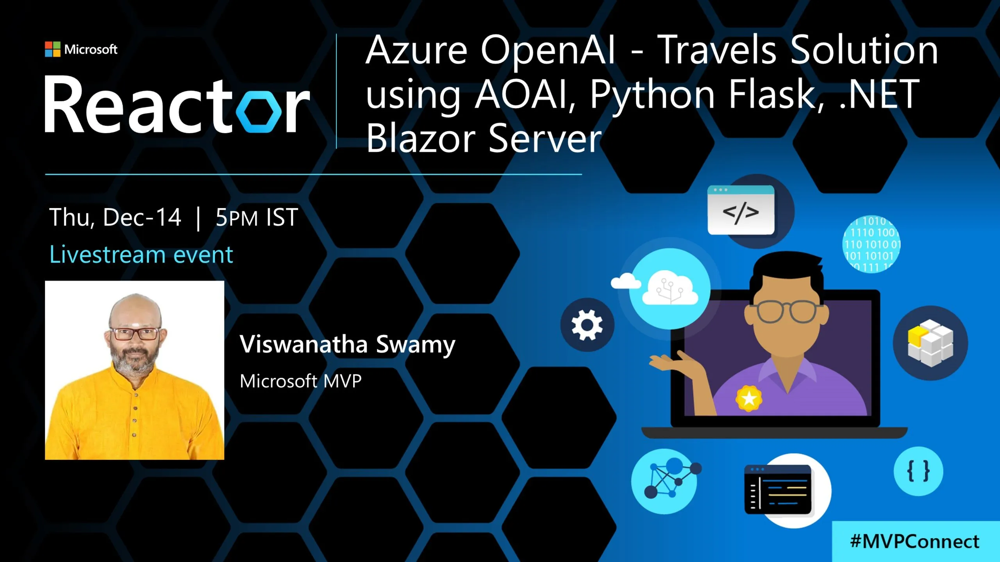
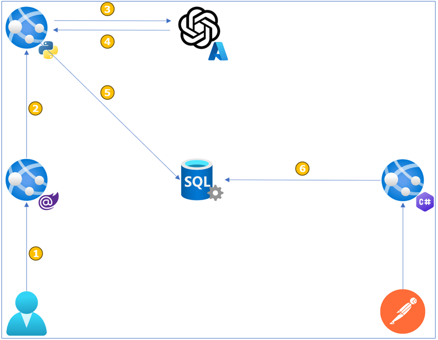
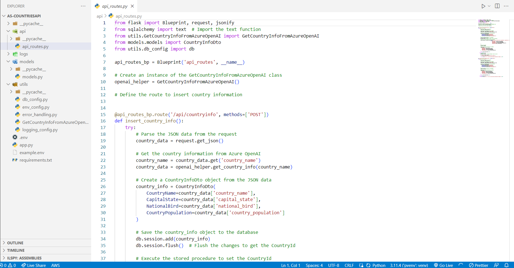
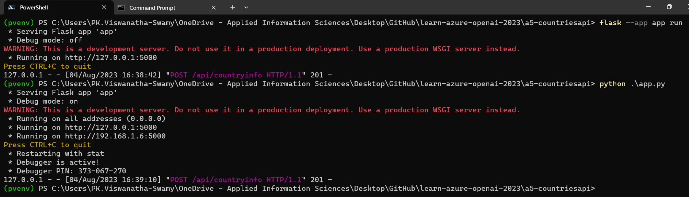
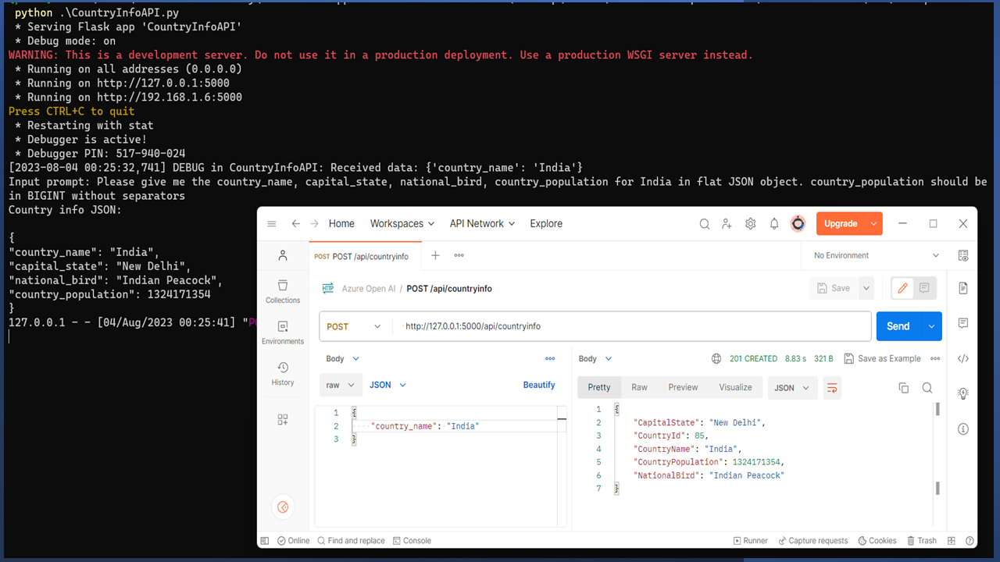

# Azure OpenAI - Travels Solution using AOAI, Python Flask, .NET Blazor Server

## Date Time: 14-Dec-2023 at 05:00 PM IST

## Event URL: [https://www.meetup.com/microsoft-reactor-bengaluru/events/297372481](https://www.meetup.com/microsoft-reactor-bengaluru/events/297372481)

## YouTube URL: [https://www.youtube.com/watch?v=9L_ebd9P-xM](https://www.youtube.com/watch?v=9L_ebd9P-xM)



---

### Software/Tools

> 1. OS: Windows 10 x64
> 1. Python / .NET 7
> 1. Visual Studio 2022
> 1. Visual Studio Code

### Prior Knowledge

> 1. Programming knowledge in C# / Python
> 1. Azure

## Technology Stack

> 1. .NET 8, Azure, OpenAI, Python Flask, HTML, CSS, JavaScript

## Information


## What are we doing today?

> 1. Creating a Python Flask API to Interact with Azure Open AI
> 1. Test Python Flask API using Postman
> 1. Creating a Blazor Server Admin Application
> 1. Integrate Blazor Server Admin Application with Python Flask API
> 1. SUMMARY / RECAP / Q&A
> 1. What is next ?

### Please refer to the [**Source Code**](https://github.com/ViswanathaSwamy-PK-TechSkillz-Academy/learn-azure-openai/tree/main) of today's session for more details

---


---

## The Big Picture

> 1. Discussion on what we are going to do today.

**Note:** The diagram is wrong.



## 1. Creating a Python Flask API to Interact with Azure Open AI

> 1. Python Flask API
> 1. Python Flask Web API Project Structure

### 1.1 Python Flask API

#### Lightweight and Easy to Use

> 1. Flask is a lightweight web framework for Python that is designed to be simple and easy to use. It provides the essentials needed for building web applications without unnecessary complexity. This simplicity makes it an excellent choice for beginners and for projects where a minimalistic approach is preferred.

#### Extensible and Modular

> 1. Flask follows a modular design, allowing developers to use only the components they need. It is extensible, meaning that you can add various extensions to enhance its functionality, such as authentication, database integration, and more. This modular and extensible nature makes Flask flexible and adaptable to different project requirements.

### 1.2. Python Flask Web API Project Structure

> 1. `api_routes.py`: This file contains API routes and handling for adding country information.
> 1. `models.py`: This file defines the SQLAlchemy database model for the CountryInfoDto table.
> 1. `db_config.py`: This file contains the SQLAlchemy database configuration using the db object.
> 1. `env_config.py`: This file handles loading environment variables from the .env file.
> 1. `error_handling.py`: This file contains the utility function for handling error responses.
> 1. `GetCountryInfoFromAzureOpenAI.py`: This file handles integration with Azure OpenAI to fetch country information.
> 1. `logging_config.py`: This file configures logging settings for the Flask app.
> 1. `app.py`: This file is the entry point of the Flask application and sets up the app with configurations.



### 1.3. How to execute the Python Flask API?

```python
flask --app app run

python .\app.py
```



## 2. Testing Python Flask Web API using Postman

> 1. Discussion and Demo



## 3. Creating a Blazor Server Admin Application

> 1. Discussion and Demo

## 4. Integrate Blazor Server Admin Application with Python Flask API

> 1. Discussion and Demo

---

## X. SUMMARY / RECAP / Q&A

> 1. SUMMARY / RECAP / Q&A
> 2. Any open queries, I will get back through meetup chat/twitter.

---

## What is Next? session?

> 1. Discussion
